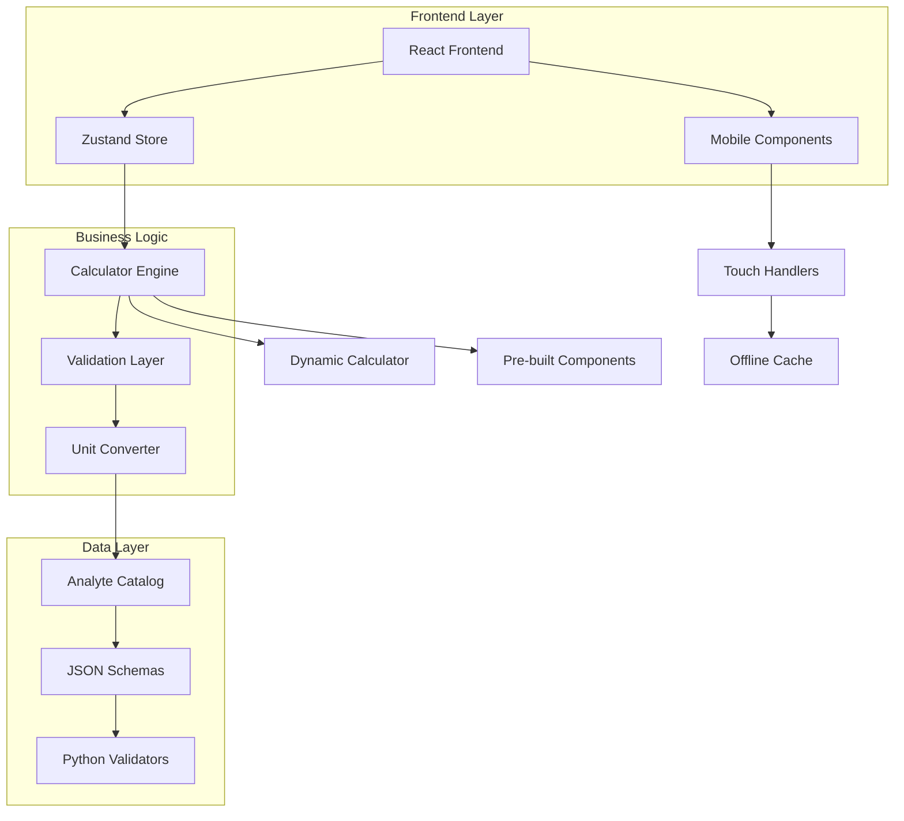

# Arquitetura Técnica - Sistema de Calculadoras Médicas

## 1. Visão Geral da Arquitetura



## 2. Descrição das Tecnologias

- **Frontend**: React@18 + TypeScript + Tailwind CSS + Vite
- **State Management**: Zustand para estado global
- **Mobile**: PWA com Service Workers
- **Validação**: Zod para schemas TypeScript
- **Testes**: Jest + React Testing Library
- **Build**: Vite com code splitting

## 3. Definições de Rotas

| Rota | Propósito |
|------|----------|
| `/` | Dashboard principal com grid de calculadoras |
| `/calculator/:id` | Calculadora individual (dinâmica ou pré-construída) |
| `/catalog/analytes` | Catálogo navegável de analitos |
| `/catalog/units` | Conversor de unidades |
| `/history` | Histórico de cálculos do usuário |
| `/create` | Editor para criar novas calculadoras |
| `/mobile` | Interface otimizada para mobile |

## 4. Estrutura de Componentes

### 4.1 Hierarquia de Componentes

```
App/
├── Layout/
│   ├── Header.tsx
│   ├── Navigation.tsx
│   └── MobileNavigation.tsx
├── Dashboard/
│   ├── CalculatorGrid.tsx
│   ├── SearchBar.tsx
│   └── CategoryFilter.tsx
├── Calculators/
│   ├── PreBuilt/
│   │   ├── BMICalculator.tsx
│   │   ├── BSACalculator.tsx
│   │   ├── CockcroftGaultCalculator.tsx
│   │   ├── FriedewaldCalculator.tsx
│   │   ├── CorrectedCalciumCalculator.tsx
│   │   ├── IdealBodyWeightCalculator.tsx
│   │   ├── OsmolarityCalculator.tsx
│   │   ├── FeNaCalculator.tsx
│   │   ├── IronDeficitCalculator.tsx
│   │   └── PaO2FiO2Calculator.tsx
│   ├── Dynamic/
│   │   ├── DynamicCalculator.tsx
│   │   ├── FormulaRenderer.tsx
│   │   └── SchemaValidator.tsx
│   └── Common/
│       ├── CalculatorCard.tsx
│       ├── InputField.tsx
│       ├── ResultDisplay.tsx
│       ├── FormulaDisplay.tsx
│       ├── ReferenceLinks.tsx
│       └── InterpretationPanel.tsx
├── Catalog/
│   ├── AnalytesCatalog.tsx
│   ├── UnitConverter.tsx
│   ├── ConversionTable.tsx
│   └── SearchableList.tsx
├── Mobile/
│   ├── TouchOptimizedInput.tsx
│   ├── SwipeableCalculator.tsx
│   ├── BottomNavigation.tsx
│   └── PullToRefresh.tsx
└── Utils/
    ├── ValidationHelpers.tsx
    ├── UnitConversions.tsx
    ├── MobileDetection.tsx
    └── OfflineSync.tsx
```

### 4.2 Componentes Principais

**CalculatorCard.tsx**
```typescript
interface CalculatorCardProps {
  calculator: Calculator;
  onOpen: (id: string) => void;
  isMobile?: boolean;
}

/**
 * Card component for displaying calculator preview
 * 
 * Integrates with:
 * - Dashboard/CalculatorGrid.tsx for grid layout
 * - store/calculatorStore.js for state management
 * - Mobile/TouchOptimizedInput.tsx for mobile interactions
 */
export const CalculatorCard: React.FC<CalculatorCardProps> = ({
  calculator,
  onOpen,
  isMobile = false
}) => {
  // Component implementation
};
```

**DynamicCalculator.tsx**
```typescript
interface DynamicCalculatorProps {
  schema: CalculatorSchema;
  onResult: (result: CalculationResult) => void;
}

/**
 * Renders calculators from JSON schema
 * 
 * Integrates with:
 * - schemas/*.json for calculator definitions
 * - utils/ValidationHelpers.tsx for input validation
 * - store/calculatorStore.js for result storage
 */
export const DynamicCalculator: React.FC<DynamicCalculatorProps> = ({
  schema,
  onResult
}) => {
  // Dynamic rendering logic
};
```

**UnitConverter.tsx**
```typescript
interface UnitConverterProps {
  analyte: Analyte;
  value: number;
  fromUnit: string;
  toUnit: string;
  onChange: (convertedValue: number) => void;
}

/**
 * Universal unit converter component
 * 
 * Integrates with:
 * - catalog/analytes.json for conversion factors
 * - utils/UnitConversions.tsx for conversion logic
 * - Calculators/* for automatic unit conversion
 */
export const UnitConverter: React.FC<UnitConverterProps> = ({
  analyte,
  value,
  fromUnit,
  toUnit,
  onChange
}) => {
  // Conversion implementation
};
```

## 5. Gerenciamento de Estado

### 5.1 Zustand Store Structure

```typescript
interface CalculatorStore {
  // Calculator Management
  calculators: Calculator[];
  activeCalculator: string | null;
  calculationHistory: CalculationResult[];
  
  // Catalog Data
  analytes: Analyte[];
  units: Unit[];
  conversionFactors: ConversionFactor[];
  
  // UI State
  isMobile: boolean;
  isOffline: boolean;
  searchQuery: string;
  selectedCategory: string;
  
  // Actions
  setActiveCalculator: (id: string) => void;
  addCalculationResult: (result: CalculationResult) => void;
  convertUnit: (value: number, from: Unit, to: Unit, analyte?: Analyte) => number;
  searchCalculators: (query: string) => Calculator[];
  filterByCategory: (category: string) => Calculator[];
  syncOfflineData: () => Promise<void>;
}

// Store implementation
export const useCalculatorStore = create<CalculatorStore>((set, get) => ({
  calculators: [],
  activeCalculator: null,
  calculationHistory: [],
  analytes: [],
  units: [],
  conversionFactors: [],
  isMobile: false,
  isOffline: false,
  searchQuery: '',
  selectedCategory: 'all',
  
  setActiveCalculator: (id) => set({ activeCalculator: id }),
  
  addCalculationResult: (result) => set((state) => ({
    calculationHistory: [result, ...state.calculationHistory.slice(0, 99)]
  })),
  
  convertUnit: (value, from, to, analyte) => {
    // Unit conversion logic
    const factor = getConversionFactor(from, to, analyte);
    return value * factor;
  },
  
  searchCalculators: (query) => {
    const { calculators } = get();
    return calculators.filter(calc => 
      calc.name.toLowerCase().includes(query.toLowerCase()) ||
      calc.domain.toLowerCase().includes(query.toLowerCase())
    );
  },
  
  filterByCategory: (category) => {
    const { calculators } = get();
    if (category === 'all') return calculators;
    return calculators.filter(calc => calc.domain === category);
  },
  
  syncOfflineData: async () => {
    // Offline synchronization logic
  }
}));
```

### 5.2 Custom Hooks

**useCalculator Hook**
```typescript
interface UseCalculatorReturn {
  calculate: (inputs: Record<string, any>) => CalculationResult;
  validate: (inputs: Record<string, any>) => ValidationResult;
  isLoading: boolean;
  error: string | null;
}

/**
 * Custom hook for calculator logic
 * 
 * Integrates with:
 * - store/calculatorStore.js for state management
 * - utils/ValidationHelpers.tsx for input validation
 * - schemas/*.json for calculator definitions
 */
export const useCalculator = (calculatorId: string): UseCalculatorReturn => {
  const [isLoading, setIsLoading] = useState(false);
  const [error, setError] = useState<string | null>(null);
  
  const calculate = useCallback((inputs: Record<string, any>) => {
    setIsLoading(true);
    setError(null);
    
    try {
      // Calculation logic
      const result = performCalculation(calculatorId, inputs);
      return result;
    } catch (err) {
      setError(err.message);
      throw err;
    } finally {
      setIsLoading(false);
    }
  }, [calculatorId]);
  
  const validate = useCallback((inputs: Record<string, any>) => {
    // Validation logic
    return validateInputs(calculatorId, inputs);
  }, [calculatorId]);
  
  return { calculate, validate, isLoading, error };
};
```

**useMobileOptimization Hook**
```typescript
interface UseMobileOptimizationReturn {
  isMobile: boolean;
  isTablet: boolean;
  orientation: 'portrait' | 'landscape';
  touchSupport: boolean;
  optimizeForTouch: (element: HTMLElement) => void;
}

/**
 * Mobile optimization utilities
 * 
 * Integrates with:
 * - Mobile/* components for responsive behavior
 * - utils/MobileDetection.tsx for device detection
 * - CSS classes for responsive styling
 */
export const useMobileOptimization = (): UseMobileOptimizationReturn => {
  const [isMobile, setIsMobile] = useState(false);
  const [isTablet, setIsTablet] = useState(false);
  const [orientation, setOrientation] = useState<'portrait' | 'landscape'>('portrait');
  const [touchSupport, setTouchSupport] = useState(false);
  
  useEffect(() => {
    // Device detection logic
    const checkDevice = () => {
      setIsMobile(window.innerWidth < 640);
      setIsTablet(window.innerWidth >= 640 && window.innerWidth < 1024);
      setOrientation(window.innerHeight > window.innerWidth ? 'portrait' : 'landscape');
      setTouchSupport('ontouchstart' in window);
    };
    
    checkDevice();
    window.addEventListener('resize', checkDevice);
    return () => window.removeEventListener('resize', checkDevice);
  }, []);
  
  const optimizeForTouch = useCallback((element: HTMLElement) => {
    if (touchSupport) {
      element.style.minHeight = '44px';
      element.style.minWidth = '44px';
      element.style.padding = '12px';
    }
  }, [touchSupport]);
  
  return { isMobile, isTablet, orientation, touchSupport, optimizeForTouch };
};
```

## 6. Esquemas de Dados

### 6.1 Calculator Schema

```typescript
interface Calculator {
  id: string;
  name: string;
  domain: string;
  description: string;
  type: 'prebuilt' | 'dynamic';
  inputs: InputField[];
  output: OutputField;
  formula: string;
  interpretation?: InterpretationRule[];
  references: Reference[];
  validation: ValidationRule[];
  metadata: CalculatorMetadata;
}

interface InputField {
  name: string;
  symbol: string;
  type: 'number' | 'string' | 'select' | 'boolean';
  unit?: string;
  description: string;
  validation: FieldValidation;
  defaultValue?: any;
  options?: SelectOption[]; // For select type
}

interface OutputField {
  name: string;
  symbol: string;
  unit: string;
  precision: number;
  interpretation?: InterpretationRule[];
}

interface InterpretationRule {
  condition: string; // e.g., "<18.5", ">=30"
  label: string;
  color?: 'green' | 'yellow' | 'red' | 'blue';
  description?: string;
}

interface Reference {
  citation: string;
  url?: string;
  doi?: string;
  year?: number;
}

interface CalculatorMetadata {
  version: string;
  lastUpdated: string;
  author: string;
  medicalReview: {
    reviewer: string;
    date: string;
    approved: boolean;
  };
  usage: {
    totalCalculations: number;
    averageRating: number;
  };
}
```

### 6.2 Analyte Schema

```typescript
interface Analyte {
  id: string;
  name: string;
  symbol: string;
  family: AnalyteFamily;
  description: string;
  units: AnalyteUnit[];
  referenceRanges: ReferenceRange[];
  clinicalSignificance: string;
  methodology?: string[];
  interferences?: string[];
}

interface AnalyteUnit {
  name: string;
  symbol: string;
  isSI: boolean;
  conversionFactor: number; // Factor to convert to base unit
  precision: number;
}

interface ReferenceRange {
  population: string; // e.g., "adult_male", "pediatric", "elderly"
  ageRange?: { min: number; max: number };
  unit: string;
  range: {
    min?: number;
    max?: number;
    target?: number;
  };
  condition?: string; // e.g., "fasting", "random"
}

type AnalyteFamily = 
  | 'electrolytes'
  | 'metabolites'
  | 'lipids'
  | 'liver_enzymes'
  | 'hormones'
  | 'vitamins'
  | 'inflammatory_markers'
  | 'catecholamines'
  | 'blood_gases'
  | 'hematology'
  | 'cardiac_markers'
  | 'other';
```

### 6.3 Calculation Result Schema

```typescript
interface CalculationResult {
  id: string;
  calculatorId: string;
  timestamp: string;
  inputs: Record<string, any>;
  outputs: Record<string, any>;
  interpretation?: string;
  warnings?: string[];
  metadata: {
    version: string;
    executionTime: number;
    userAgent: string;
  };
}

interface ValidationResult {
  isValid: boolean;
  errors: ValidationError[];
  warnings: ValidationWarning[];
}

interface ValidationError {
  field: string;
  message: string;
  code: string;
}

interface ValidationWarning {
  field: string;
  message: string;
  severity: 'low' | 'medium' | 'high';
}
```

## 7. Validação e Segurança

### 7.1 Input Validation

```typescript
/**
 * Comprehensive input validation system
 * 
 * Integrates with:
 * - Zod schemas for type safety
 * - Medical range validation
 * - Unit consistency checks
 */
export class CalculatorValidator {
  private schemas: Map<string, z.ZodSchema> = new Map();
  
  constructor() {
    this.initializeSchemas();
  }
  
  validateInputs(calculatorId: string, inputs: Record<string, any>): ValidationResult {
    const schema = this.schemas.get(calculatorId);
    if (!schema) {
      throw new Error(`No validation schema found for calculator: ${calculatorId}`);
    }
    
    try {
      schema.parse(inputs);
      
      // Additional medical validation
      const medicalValidation = this.validateMedicalRanges(calculatorId, inputs);
      
      return {
        isValid: medicalValidation.isValid,
        errors: medicalValidation.errors,
        warnings: medicalValidation.warnings
      };
    } catch (error) {
      if (error instanceof z.ZodError) {
        return {
          isValid: false,
          errors: error.errors.map(err => ({
            field: err.path.join('.'),
            message: err.message,
            code: err.code
          })),
          warnings: []
        };
      }
      throw error;
    }
  }
  
  private validateMedicalRanges(calculatorId: string, inputs: Record<string, any>): ValidationResult {
    // Medical range validation logic
    const errors: ValidationError[] = [];
    const warnings: ValidationWarning[] = [];
    
    // Example: BMI validation
    if (calculatorId === 'bmi') {
      const { weight, height } = inputs;
      
      if (weight < 1 || weight > 500) {
        errors.push({
          field: 'weight',
          message: 'Peso deve estar entre 1 e 500 kg',
          code: 'INVALID_RANGE'
        });
      }
      
      if (height < 0.3 || height > 3.0) {
        errors.push({
          field: 'height',
          message: 'Altura deve estar entre 0.3 e 3.0 metros',
          code: 'INVALID_RANGE'
        });
      }
      
      if (weight > 200) {
        warnings.push({
          field: 'weight',
          message: 'Peso muito elevado - verificar se está correto',
          severity: 'medium'
        });
      }
    }
    
    return {
      isValid: errors.length === 0,
      errors,
      warnings
    };
  }
  
  private initializeSchemas(): void {
    // BMI Schema
    this.schemas.set('bmi', z.object({
      weight: z.number().min(1).max(500),
      height: z.number().min(0.3).max(3.0)
    }));
    
    // Cockcroft-Gault Schema
    this.schemas.set('cockcroft_gault', z.object({
      age: z.number().min(18).max(120),
      weight: z.number().min(1).max(500),
      creatinine: z.number().min(0.1).max(20),
      sex: z.enum(['male', 'female'])
    }));
    
    // Add more schemas...
  }
}
```

### 7.2 Calculation Engine

```typescript
/**
 * Safe calculation engine with formula execution
 * 
 * Integrates with:
 * - JSON calculator schemas
 * - Validation system
 * - Unit conversion system
 */
export class CalculationEngine {
  private validator: CalculatorValidator;
  private unitConverter: UnitConverter;
  
  constructor() {
    this.validator = new CalculatorValidator();
    this.unitConverter = new UnitConverter();
  }
  
  async calculate(calculatorId: string, inputs: Record<string, any>): Promise<CalculationResult> {
    // Validate inputs
    const validation = this.validator.validateInputs(calculatorId, inputs);
    if (!validation.isValid) {
      throw new Error(`Validation failed: ${validation.errors.map(e => e.message).join(', ')}`);
    }
    
    // Load calculator schema
    const calculator = await this.loadCalculator(calculatorId);
    
    // Convert units if necessary
    const normalizedInputs = this.normalizeUnits(calculator, inputs);
    
    // Execute calculation
    const startTime = performance.now();
    const result = this.executeFormula(calculator, normalizedInputs);
    const executionTime = performance.now() - startTime;
    
    // Apply interpretation rules
    const interpretation = this.applyInterpretation(calculator, result);
    
    return {
      id: generateId(),
      calculatorId,
      timestamp: new Date().toISOString(),
      inputs: normalizedInputs,
      outputs: result,
      interpretation,
      warnings: validation.warnings.map(w => w.message),
      metadata: {
        version: calculator.metadata.version,
        executionTime,
        userAgent: navigator.userAgent
      }
    };
  }
  
  private executeFormula(calculator: Calculator, inputs: Record<string, any>): Record<string, any> {
    // Safe formula execution
    const context = { ...inputs, Math };
    
    try {
      // Use Function constructor for safe evaluation
      const formula = new Function(...Object.keys(context), `return ${calculator.formula}`);
      const result = formula(...Object.values(context));
      
      return {
        [calculator.output.symbol]: this.roundToPrecision(result, calculator.output.precision)
      };
    } catch (error) {
      throw new Error(`Formula execution failed: ${error.message}`);
    }
  }
  
  private applyInterpretation(calculator: Calculator, result: Record<string, any>): string | undefined {
    if (!calculator.interpretation) return undefined;
    
    const outputValue = result[calculator.output.symbol];
    
    for (const rule of calculator.interpretation) {
      if (this.evaluateCondition(rule.condition, outputValue)) {
        return rule.label;
      }
    }
    
    return undefined;
  }
  
  private evaluateCondition(condition: string, value: number): boolean {
    // Safe condition evaluation
    const operators = {
      '<': (a: number, b: number) => a < b,
      '<=': (a: number, b: number) => a <= b,
      '>': (a: number, b: number) => a > b,
      '>=': (a: number, b: number) => a >= b,
      '==': (a: number, b: number) => a === b,
      '!=': (a: number, b: number) => a !== b
    };
    
    // Parse condition (e.g., "<18.5", ">=30")
    const match = condition.match(/^(<=|>=|<|>|==|!=)([0-9.]+)$/);
    if (!match) return false;
    
    const [, operator, threshold] = match;
    const thresholdValue = parseFloat(threshold);
    
    return operators[operator as keyof typeof operators](value, thresholdValue);
  }
  
  private roundToPrecision(value: number, precision: number): number {
    return Math.round(value * Math.pow(10, precision)) / Math.pow(10, precision);
  }
  
  private async loadCalculator(calculatorId: string): Promise<Calculator> {
    // Load calculator schema from JSON
    const response = await fetch(`/schemas/${calculatorId}.json`);
    if (!response.ok) {
      throw new Error(`Calculator not found: ${calculatorId}`);
    }
    return response.json();
  }
  
  private normalizeUnits(calculator: Calculator, inputs: Record<string, any>): Record<string, any> {
    const normalized = { ...inputs };
    
    for (const input of calculator.inputs) {
      if (input.unit && normalized[input.symbol] !== undefined) {
        // Convert to standard unit if necessary
        normalized[input.symbol] = this.unitConverter.toStandardUnit(
          normalized[input.symbol],
          input.unit,
          input.name
        );
      }
    }
    
    return normalized;
  }
}
```

## 8. Otimização Mobile

### 8.1 Service Worker para Cache

```typescript
/**
 * Service Worker for offline functionality
 * 
 * Integrates with:
 * - Calculator schemas for offline access
 * - Calculation history for offline storage
 * - PWA manifest for app-like experience
 */
const CACHE_NAME = 'medical-calculators-v1';
const STATIC_ASSETS = [
  '/',
  '/static/js/bundle.js',
  '/static/css/main.css',
  '/schemas/bmi.json',
  '/schemas/bsa_mosteller.json',
  '/schemas/cockcroft_gault.json'
  // Add all calculator schemas
];

self.addEventListener('install', (event: ExtendableEvent) => {
  event.waitUntil(
    caches.open(CACHE_NAME)
      .then(cache => cache.addAll(STATIC_ASSETS))
  );
});

self.addEventListener('fetch', (event: FetchEvent) => {
  event.respondWith(
    caches.match(event.request)
      .then(response => {
        // Return cached version or fetch from network
        return response || fetch(event.request);
      })
  );
});
```

### 8.2 Touch Optimization

```typescript
/**
 * Touch-optimized input component
 * 
 * Integrates with:
 * - Mobile detection utilities
 * - Haptic feedback API
 * - Virtual keyboard optimization
 */
export const TouchOptimizedInput: React.FC<TouchInputProps> = ({
  type,
  value,
  onChange,
  placeholder,
  unit
}) => {
  const { isMobile, touchSupport } = useMobileOptimization();
  const inputRef = useRef<HTMLInputElement>(null);
  
  const handleTouchStart = useCallback(() => {
    if (touchSupport && 'vibrate' in navigator) {
      navigator.vibrate(10); // Subtle haptic feedback
    }
  }, [touchSupport]);
  
  const handleFocus = useCallback(() => {
    if (isMobile && inputRef.current) {
      // Scroll input into view on mobile
      inputRef.current.scrollIntoView({ behavior: 'smooth', block: 'center' });
    }
  }, [isMobile]);
  
  return (
    <div className={`relative ${isMobile ? 'mb-6' : 'mb-4'}`}>
      <input
        ref={inputRef}
        type={type === 'number' ? 'number' : 'text'}
        inputMode={type === 'number' ? 'decimal' : 'text'}
        value={value}
        onChange={(e) => onChange(e.target.value)}
        placeholder={placeholder}
        onTouchStart={handleTouchStart}
        onFocus={handleFocus}
        className={`
          w-full px-4 py-3 border border-gray-300 rounded-lg
          focus:ring-2 focus:ring-blue-500 focus:border-transparent
          ${isMobile ? 'text-lg min-h-[44px]' : 'text-base'}
          ${touchSupport ? 'touch-manipulation' : ''}
        `}
        style={{
          fontSize: isMobile ? '16px' : '14px', // Prevent zoom on iOS
          minHeight: touchSupport ? '44px' : 'auto'
        }}
      />
      {unit && (
        <span className="absolute right-3 top-1/2 transform -translate-y-1/2 text-gray-500">
          {unit}
        </span>
      )}
    </div>
  );
};
```

## 9. Performance e Otimização

### 9.1 Code Splitting

```typescript
// Lazy loading of calculator components
const BMICalculator = lazy(() => import('./PreBuilt/BMICalculator'));
const BSACalculator = lazy(() => import('./PreBuilt/BSACalculator'));
const CockcroftGaultCalculator = lazy(() => import('./PreBuilt/CockcroftGaultCalculator'));

// Route-based code splitting
const Dashboard = lazy(() => import('./Dashboard/Dashboard'));
const CalculatorView = lazy(() => import('./Calculators/CalculatorView'));
const CatalogView = lazy(() => import('./Catalog/CatalogView'));

/**
 * Dynamic import wrapper with error handling
 * 
 * Integrates with:
 * - React.Suspense for loading states
 * - Error boundaries for fallback UI
 * - Preloading strategies for better UX
 */
export const withLazyLoading = <T extends ComponentType<any>>(
  importFunc: () => Promise<{ default: T }>,
  fallback: ComponentType = LoadingSpinner
) => {
  const LazyComponent = lazy(importFunc);
  
  return (props: ComponentProps<T>) => (
    <Suspense fallback={<fallback />}>
      <LazyComponent {...props} />
    </Suspense>
  );
};
```

### 9.2 Bundle Optimization

```typescript
// vite.config.ts
export default defineConfig({
  build: {
    rollupOptions: {
      output: {
        manualChunks: {
          // Vendor chunks
          vendor: ['react', 'react-dom'],
          ui: ['@headlessui/react', 'lucide-react'],
          
          // Feature chunks
          calculators: [
            './src/components/Calculators/PreBuilt/BMICalculator.tsx',
            './src/components/Calculators/PreBuilt/BSACalculator.tsx'
          ],
          catalog: [
            './src/components/Catalog/AnalytesCatalog.tsx',
            './src/components/Catalog/UnitConverter.tsx'
          ]
        }
      }
    },
    target: 'es2020',
    minify: 'terser',
    terserOptions: {
      compress: {
        drop_console: true,
        drop_debugger: true
      }
    }
  },
  optimizeDeps: {
    include: ['react', 'react-dom', 'zustand']
  }
});
```

## 10. Testes

### 10.1 Testes de Calculadoras

```typescript
/**
 * Comprehensive calculator testing suite
 * 
 * Integrates with:
 * - Jest for test framework
 * - React Testing Library for component testing
 * - Medical validation for accuracy testing
 */
describe('BMI Calculator', () => {
  const mockCalculator: Calculator = {
    id: 'bmi',
    name: 'Índice de Massa Corporal',
    domain: 'antropometria',
    type: 'prebuilt',
    formula: 'weight / (height * height)',
    // ... other properties
  };
  
  describe('Calculation Accuracy', () => {
    it('should calculate BMI correctly for normal values', () => {
      const inputs = { weight: 70, height: 1.75 };
      const result = calculateBMI(inputs);
      
      expect(result.bmi).toBeCloseTo(22.86, 2);
      expect(result.interpretation).toBe('Peso normal');
    });
    
    it('should handle edge cases correctly', () => {
      const inputs = { weight: 50, height: 2.0 };
      const result = calculateBMI(inputs);
      
      expect(result.bmi).toBeCloseTo(12.5, 2);
      expect(result.interpretation).toBe('Baixo peso');
    });
  });
  
  describe('Input Validation', () => {
    it('should reject invalid weight values', () => {
      const inputs = { weight: -10, height: 1.75 };
      
      expect(() => calculateBMI(inputs)).toThrow('Peso deve ser positivo');
    });
    
    it('should reject invalid height values', () => {
      const inputs = { weight: 70, height: 0 };
      
      expect(() => calculateBMI(inputs)).toThrow('Altura deve ser positiva');
    });
  });
  
  describe('Medical Validation', () => {
    it('should provide correct WHO classifications', () => {
      const testCases = [
        { weight: 45, height: 1.70, expected: 'Baixo peso' },
        { weight: 65, height: 1.70, expected: 'Peso normal' },
        { weight: 80, height: 1.70, expected: 'Sobrepeso' },
        { weight: 95, height: 1.70, expected: 'Obesidade' }
      ];
      
      testCases.forEach(({ weight, height, expected }) => {
        const result = calculateBMI({ weight, height });
        expect(result.interpretation).toBe(expected);
      });
    });
  });
});
```

### 10.2 Testes de Integração

```typescript
describe('Calculator Integration', () => {
  it('should integrate with unit converter correctly', async () => {
    const calculator = await loadCalculator('cockcroft_gault');
    const inputs = {
      age: 65,
      weight: 70,
      creatinine: 1.2, // mg/dL
      sex: 'male'
    };
    
    // Test with different units
    const inputsWithConversion = {
      ...inputs,
      creatinine: 106.08, // μmol/L (equivalent to 1.2 mg/dL)
      creatinine_unit: 'μmol/L'
    };
    
    const result1 = await calculate(calculator.id, inputs);
    const result2 = await calculate(calculator.id, inputsWithConversion);
    
    expect(result1.clearance).toBeCloseTo(result2.clearance, 1);
  });
  
  it('should maintain calculation history correctly', async () => {
    const store = useCalculatorStore.getState();
    const initialHistoryLength = store.calculationHistory.length;
    
    await calculate('bmi', { weight: 70, height: 1.75 });
    
    const updatedStore = useCalculatorStore.getState();
    expect(updatedStore.calculationHistory.length).toBe(initialHistoryLength + 1);
    expect(updatedStore.calculationHistory[0].calculatorId).toBe('bmi');
  });
});
```

## 11. Deployment e CI/CD

### 11.1 Build Pipeline

```yaml
# .github/workflows/deploy.yml
name: Deploy Medical Calculators

on:
  push:
    branches: [main]
  pull_request:
    branches: [main]

jobs:
  test:
    runs-on: ubuntu-latest
    steps:
      - uses: actions/checkout@v3
      - uses: actions/setup-node@v3
        with:
          node-version: '18'
          cache: 'npm'
      
      - run: npm ci
      - run: npm run test:coverage
      - run: npm run test:medical-validation
      
      - name: Upload coverage reports
        uses: codecov/codecov-action@v3
  
  build:
    needs: test
    runs-on: ubuntu-latest
    steps:
      - uses: actions/checkout@v3
      - uses: actions/setup-node@v3
        with:
          node-version: '18'
          cache: 'npm'
      
      - run: npm ci
      - run: npm run build
      - run: npm run validate-schemas
      
      - name: Upload build artifacts
        uses: actions/upload-artifact@v3
        with:
          name: dist
          path: dist/
  
  deploy:
    needs: build
    runs-on: ubuntu-latest
    if: github.ref == 'refs/heads/main'
    steps:
      - name: Deploy to production
        run: |
          # Deployment commands
          echo "Deploying medical calculators..."
```

### 11.2 Quality Gates

```typescript
// scripts/validate-medical-accuracy.ts
/**
 * Medical accuracy validation script
 * 
 * Validates all calculators against known test cases
 * Ensures medical formulas are implemented correctly
 */
import { testCases } from './medical-test-cases.json';
import { CalculationEngine } from '../src/utils/CalculationEngine';

const engine = new CalculationEngine();

async function validateMedicalAccuracy() {
  let passed = 0;
  let failed = 0;
  
  for (const testCase of testCases) {
    try {
      const result = await engine.calculate(testCase.calculatorId, testCase.inputs);
      const expectedValue = testCase.expectedOutput.value;
      const actualValue = result.outputs[testCase.expectedOutput.field];
      
      const tolerance = testCase.tolerance || 0.01;
      const isAccurate = Math.abs(actualValue - expectedValue) <= tolerance;
      
      if (isAccurate) {
        passed++;
        console.log(`✓ ${testCase.name}: ${actualValue} (expected: ${expectedValue})`);
      } else {
        failed++;
        console.error(`✗ ${testCase.name}: ${actualValue} (expected: ${expectedValue})`);
      }
    } catch (error) {
      failed++;
      console.error(`✗ ${testCase.name}: Error - ${error.message}`);
    }
  }
  
  console.log(`\nResults: ${passed} passed, ${failed} failed`);
  
  if (failed > 0) {
    process.exit(1);
  }
}

validateMedicalAccuracy();
```

Esta arquitetura técnica fornece uma base sólida para a implementação do sistema expandido de calculadoras médicas, garantindo escalabilidade, manutenibilidade e precisão médica.