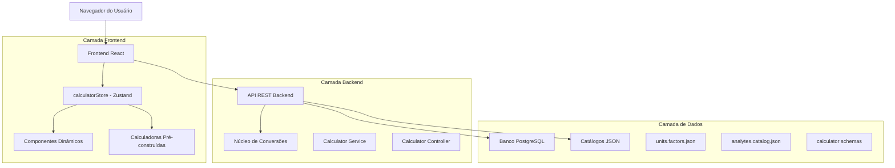
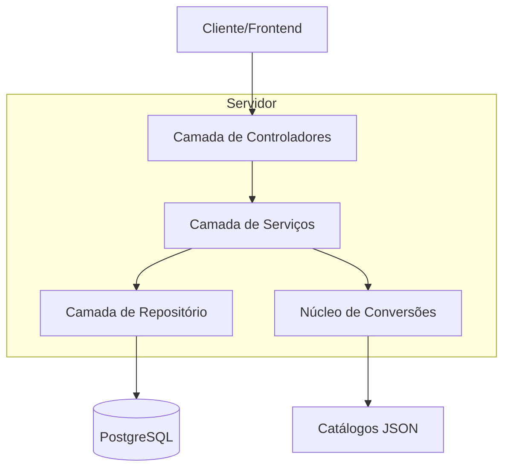
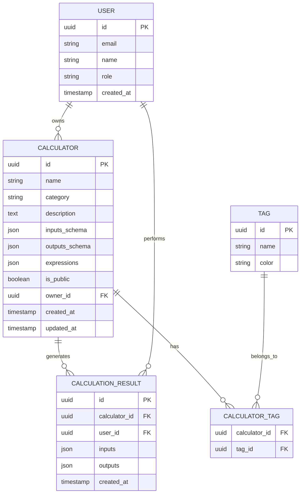

# Arquitetura Técnica - Sistema de Calculadoras Médicas Health Guardian

## 1. Arquitetura do Sistema



## 2. Descrição das Tecnologias

- **Frontend**: React@18 + Zustand + TailwindCSS + Vite
- **Backend**: Node.js + Express + Sequelize
- **Banco de Dados**: PostgreSQL (via Supabase)
- **Núcleo de Conversões**: Python (conversion_core.py)
- **Validação**: express-validator + mathjs para fórmulas

## 3. Definições de Rotas

| Rota | Propósito |
|------|----------|
| `/calculators` | Página principal com lista de calculadoras por categoria |
| `/calculators/:id` | Página específica da calculadora com interface dinâmica |
| `/conversions` | Ferramenta genérica de conversão de unidades |
| `/history` | Histórico de cálculos realizados |
| `/admin/calculators` | Painel administrativo para gestão de calculadoras |

## 4. Definições da API

### 4.1 API Principal

**Conversão de unidades**
```
POST /api/v1/convert/units
```

Request:
| Nome do Parâmetro | Tipo | Obrigatório | Descrição |
|-------------------|------|-------------|----------|
| value | number | true | Valor a ser convertido |
| from | string | true | Unidade de origem |
| to | string | true | Unidade de destino |
| analyte | string | false | Analito para conversões clínicas |

Response:
| Nome do Parâmetro | Tipo | Descrição |
|-------------------|------|----------|
| value | number | Valor convertido |
| unit | string | Unidade de destino |
| formula | string | Fórmula utilizada (opcional) |

Exemplo:
```json
{
  "value": 180,
  "from": "mg/dL",
  "to": "mmol/L",
  "analyte": "glucose"
}
```

**Listagem de calculadoras**
```
GET /api/v1/calculators
```

Response:
```json
{
  "calculators": [
    {
      "id": "infusion.drops_mlh",
      "name": "Gotas/min ↔ mL/h",
      "category": "Infusão",
      "description": "Converte taxas de gotejamento",
      "version": "1.0.0"
    }
  ]
}
```

**Schema de calculadora**
```
GET /api/v1/calculators/{id}
```

**Execução de cálculo**
```
POST /api/v1/calculators/{id}/compute
```

Request:
```json
{
  "inputs": {
    "drops_count": 30,
    "time_seconds": 20,
    "drop_factor": 20
  }
}
```

Response:
```json
{
  "outputs": {
    "gtt_per_min": 90,
    "ml_per_h": 270.0
  },
  "explanation": "Cálculo baseado na fórmula: (gotas/tempo) * 60 / fator"
}
```

## 5. Arquitetura do Servidor



## 6. Modelo de Dados

### 6.1 Definição do Modelo de Dados



### 6.2 Linguagem de Definição de Dados (DDL)

**Tabela de Calculadoras (calculators)**
```sql
-- Criar tabela
CREATE TABLE calculators (
    id UUID PRIMARY KEY DEFAULT gen_random_uuid(),
    name VARCHAR(255) NOT NULL,
    category VARCHAR(100) NOT NULL,
    description TEXT,
    inputs_schema JSONB NOT NULL,
    outputs_schema JSONB NOT NULL,
    expressions JSONB NOT NULL,
    is_public BOOLEAN DEFAULT false,
    owner_id UUID REFERENCES users(id),
    created_at TIMESTAMP WITH TIME ZONE DEFAULT NOW(),
    updated_at TIMESTAMP WITH TIME ZONE DEFAULT NOW()
);

-- Criar índices
CREATE INDEX idx_calculators_category ON calculators(category);
CREATE INDEX idx_calculators_owner ON calculators(owner_id);
CREATE INDEX idx_calculators_public ON calculators(is_public);

-- Dados iniciais - Calculadora de Gotejamento
INSERT INTO calculators (name, category, description, inputs_schema, outputs_schema, expressions, is_public)
VALUES (
    'Gotas/min ↔ mL/h',
    'Infusão',
    'Converte taxas de gotejamento em mL/h e vice-versa',
    '[
        {"id":"drops_count","label":"Gotas contadas","type":"integer","unit":"gtt","min":1},
        {"id":"time_seconds","label":"Tempo de contagem (s)","type":"number","unit":"s","min":1},
        {"id":"drop_factor","label":"Fator de gotejamento","type":"number","unit":"gtt/mL","min":5,"max":120}
    ]',
    '[
        {"id":"gtt_per_min","unit":"gtt/min","decimals":0},
        {"id":"ml_per_h","unit":"mL/h","decimals":1}
    ]',
    '{
        "gtt_per_min": "(drops_count) / (time_seconds/60)",
        "ml_per_h": "(gtt_per_min / drop_factor) * 60"
    }',
    true
);
```

**Tabela de Resultados de Cálculos (calculation_results)**
```sql
CREATE TABLE calculation_results (
    id UUID PRIMARY KEY DEFAULT gen_random_uuid(),
    calculator_id UUID REFERENCES calculators(id) ON DELETE CASCADE,
    user_id UUID REFERENCES users(id) ON DELETE CASCADE,
    inputs JSONB NOT NULL,
    outputs JSONB NOT NULL,
    created_at TIMESTAMP WITH TIME ZONE DEFAULT NOW()
);

CREATE INDEX idx_calculation_results_calculator ON calculation_results(calculator_id);
CREATE INDEX idx_calculation_results_user ON calculation_results(user_id);
CREATE INDEX idx_calculation_results_created_at ON calculation_results(created_at DESC);
```

**Tabela de Tags (tags)**
```sql
CREATE TABLE tags (
    id UUID PRIMARY KEY DEFAULT gen_random_uuid(),
    name VARCHAR(100) UNIQUE NOT NULL,
    color VARCHAR(20) DEFAULT '#6B7280',
    created_at TIMESTAMP WITH TIME ZONE DEFAULT NOW()
);

-- Dados iniciais de tags
INSERT INTO tags (name, color) VALUES
    ('infusão', '#0D9488'),
    ('conversão', '#7C3AED'),
    ('laboratório', '#DC2626'),
    ('função renal', '#2563EB'),
    ('farmacologia', '#059669');
```

**Tabela de Relacionamento Calculadora-Tag (calculator_tags)**
```sql
CREATE TABLE calculator_tags (
    calculator_id UUID REFERENCES calculators(id) ON DELETE CASCADE,
    tag_id UUID REFERENCES tags(id) ON DELETE CASCADE,
    PRIMARY KEY (calculator_id, tag_id)
);
```

## 7. Núcleo de Conversões

### 7.1 Estrutura de Catálogos JSON

**units.factors.json** - Define fatores de conversão para todas as dimensões:
```json
{
  "dimensions": {
    "mass": {
      "base_unit": "kg",
      "units": {
        "kg": { "factor": 1, "precision": 3 },
        "g": { "factor": 0.001, "precision": 3 },
        "mg": { "factor": 1e-6, "precision": 2 },
        "µg": { "factor": 1e-9, "precision": 1 }
      }
    },
    "volume": {
      "base_unit": "L",
      "units": {
        "L": { "factor": 1, "precision": 3 },
        "mL": { "factor": 0.001, "precision": 2 }
      }
    }
  }
}
```

**analytes.catalog.json** - Define analitos clínicos com massas molares e conversões:
```json
{
  "glucose": {
    "category": "metabolite",
    "names": ["Glicose"],
    "molar_mass_g_per_mol": 180.156,
    "valence": 0,
    "units_allowed": ["mg/dL", "mmol/L"],
    "canonical_conversions": [{
      "from": "mg/dL",
      "to": "mmol/L",
      "factor": 0.0555,
      "source": "consenso clínico"
    }]
  }
}
```

### 7.2 Motor de Conversão (conversion_core.py)

```python
class ConversionEngine:
    def __init__(self):
        # Carrega catálogos JSON na inicialização
        self.load_catalogs()
    
    def convert_value(self, value, from_unit, to_unit, analyte=None):
        """Função principal de conversão"""
        # 1. Conversões canônicas baseadas em analito
        if analyte and self.has_canonical_conversion(from_unit, to_unit, analyte):
            return self.apply_canonical_conversion(value, from_unit, to_unit, analyte)
        
        # 2. Conversões mEq/L ↔ mmol/L
        if self.is_valence_conversion(from_unit, to_unit) and analyte:
            return self.apply_valence_conversion(value, from_unit, to_unit, analyte)
        
        # 3. Conversões dimensionais via SI
        return self.apply_dimensional_conversion(value, from_unit, to_unit)
```

## 8. Implementação Frontend

### 8.1 Componente de Calculadora Dinâmica

```jsx
const DynamicCalculator = ({ calculatorId, schema }) => {
  const [inputs, setInputs] = useState({});
  const [results, setResults] = useState(null);
  
  const handleCalculate = async () => {
    try {
      const response = await api.post(`/calculators/${calculatorId}/compute`, {
        inputs
      });
      setResults(response.data.outputs);
    } catch (error) {
      console.error('Erro no cálculo:', error);
    }
  };
  
  return (
    <div className="calculator-container">
      {schema.inputs.map(input => (
        <InputField
          key={input.id}
          config={input}
          value={inputs[input.id]}
          onChange={(value) => setInputs(prev => ({...prev, [input.id]: value}))}
        />
      ))}
      
      <Button onClick={handleCalculate}>Calcular</Button>
      
      {results && (
        <ResultsDisplay
          results={results}
          schema={schema.outputs}
        />
      )}
    </div>
  );
};
```

### 8.2 Store Zustand Atualizado

```javascript
const useCalculatorStore = create((set, get) => ({
  calculators: [],
  results: {},
  
  // Carrega calculadoras do backend
  loadCalculators: async () => {
    const response = await api.get('/calculators');
    set({ calculators: response.data.calculators });
  },
  
  // Executa cálculo via API
  executeCalculation: async (calculatorId, inputs) => {
    const response = await api.post(`/calculators/${calculatorId}/compute`, {
      inputs
    });
    
    set(state => ({
      results: {
        ...state.results,
        [calculatorId]: response.data.outputs
      }
    }));
    
    return response.data;
  }
}));
```

## 9. Plano de Migração

### 9.1 Fase 1: Infraestrutura Base
1. Implementar núcleo de conversões (conversion_core.py)
2. Criar catálogos JSON (units.factors.json, analytes.catalog.json)
3. Desenvolver API REST básica
4. Configurar banco de dados PostgreSQL

### 9.2 Fase 2: Calculadoras de Infusão
1. Migrar "Gotas/min ↔ mL/h" para novo sistema
2. Implementar "μg/kg/min ↔ mL/h"
3. Adicionar "mg/kg/h ↔ mL/h"
4. Desenvolver modo "Tap" para contagem de gotas

### 9.3 Fase 3: Integração Frontend
1. Criar componentes dinâmicos de calculadora
2. Atualizar calculatorStore para usar API
3. Implementar fallback para calculadoras existentes
4. Adicionar histórico de cálculos

### 9.4 Fase 4: Expansão
1. Adicionar calculadoras de função renal (CKD-EPI, Cockcroft-Gault)
2. Implementar scores clínicos (CHA₂DS₂-VASc, APACHE II)
3. Desenvolver painel administrativo
4. Integrar com "Aba de Conhecimento"

## 10. Testes e Validação

### 10.1 Testes de Conversão
```json
[
  {
    "value": 180,
    "from": "mg/dL",
    "to": "mmol/L",
    "analyte": "glucose",
    "expected": 9.99,
    "tolerance": 0.01
  }
]
```

### 10.2 Testes de Calculadoras
```json
[
  {
    "calculator_id": "infusion.drops_mlh",
    "inputs": {
      "drops_count": 30,
      "time_seconds": 20,
      "drop_factor": 20
    },
    "expected_outputs": {
      "gtt_per_min": 90,
      "ml_per_h": 270.0
    },
    "tolerance": 0.1
  }
]
```

## 11. Considerações de Segurança

1. **Validação de Entrada**: Todos os inputs são validados no frontend e backend
2. **Sanitização de Fórmulas**: Uso de mathjs com escopo limitado para avaliação segura
3. **Auditoria**: Log de todos os cálculos realizados
4. **Controle de Acesso**: Autenticação JWT para acesso às APIs
5. **Versionamento**: Controle de versões para calculadoras e catálogos

## 12. Monitoramento e Performance

1. **Métricas**: Tempo de resposta das APIs, taxa de erro de cálculos
2. **Cache**: Cache de resultados frequentes no Redis
3. **Otimização**: Lazy loading de calculadoras, debounce em cálculos em tempo real
4. **Alertas**: Monitoramento de precisão e detecção de anomalias

Esta arquitetura fornece uma base sólida e escalável para o sistema de calculadoras médicas do Health Guardian, mantendo a consistência com o design existente e permitindo expansão futura controlada.