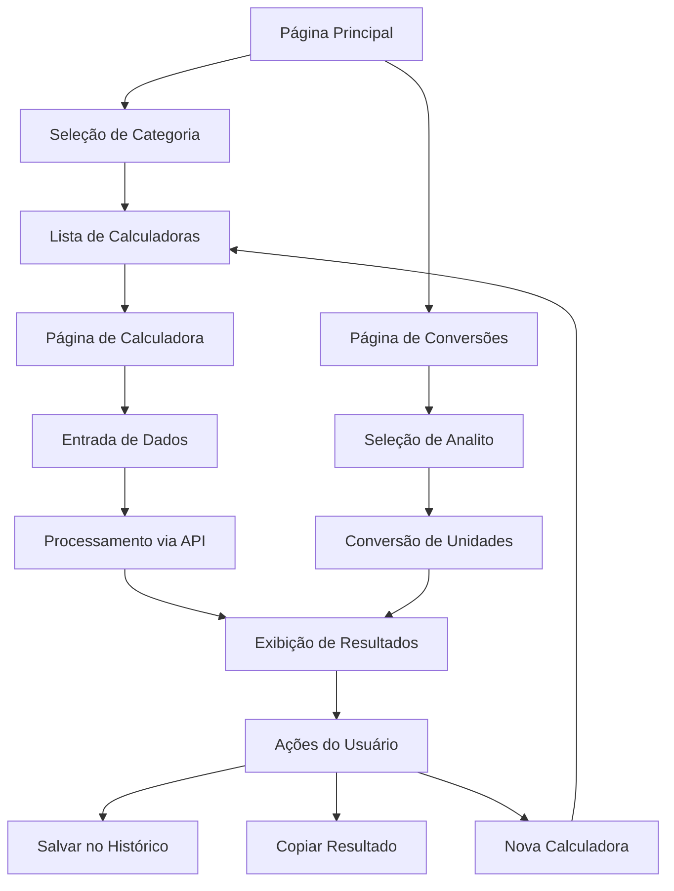

# Documento de Requisitos do Produto - Calculadoras Médicas Health Guardian

## 1. Visão Geral do Produto

O Health Guardian é uma plataforma médica que integra calculadoras clínicas, conversores de unidades e ferramentas de apoio à decisão para profissionais de saúde. O sistema oferece um núcleo robusto de conversões baseado no Sistema Internacional (SI) como verdade interna, catálogos JSON para analitos clínicos e calculadoras dinâmicas renderizadas a partir de schemas.

O produto resolve problemas críticos de precisão em cálculos médicos, padronização de unidades e acesso rápido a ferramentas essenciais durante o atendimento clínico. O público-alvo inclui médicos intensivistas, nefrologistas, farmacêuticos clínicos, enfermeiros e demais profissionais de saúde que necessitam de cálculos precisos e conversões confiáveis.

O objetivo é criar uma base sólida e escalável que permita expansão futura para novos domínios clínicos, mantendo consistência, precisão e facilidade de uso.

## 2. Funcionalidades Principais

### 2.1 Papéis de Usuário

| Papel | Método de Registro | Permissões Principais |
|-------|-------------------|----------------------|
| Profissional de Saúde | Registro por email/credenciais | Acesso completo às calculadoras, histórico de cálculos, personalização |
| Administrador | Convite/credenciais especiais | Gerenciamento de usuários, configuração de calculadoras, auditoria |

### 2.2 Módulos de Funcionalidade

Nossos requisitos de calculadoras médicas consistem nas seguintes páginas principais:

1. **Página Principal**: navegação por categorias, lista de calculadoras disponíveis, acesso rápido às ferramentas mais utilizadas.
2. **Página de Calculadora**: interface dinâmica gerada a partir de schemas JSON, campos de entrada, resultados em tempo real, botões de ação.
3. **Página de Conversões**: ferramenta genérica para conversão entre unidades clínicas, seleção de analitos, fatores de conversão transparentes.
4. **Página de Histórico**: registro de cálculos anteriores, possibilidade de repetir cálculos, exportação de resultados.
5. **Página de Administração**: gerenciamento de calculadoras, configuração de catálogos, controle de versões.

### 2.3 Detalhes das Páginas

| Nome da Página | Nome do Módulo | Descrição da Funcionalidade |
|----------------|----------------|-----------------------------|
| Página Principal | Navegação por Categorias | Exibir categorias hierárquicas (Infusão, Função Renal, Laboratório, Scores Clínicos), filtros por especialidade, busca por nome |
| Página Principal | Lista de Calculadoras | Mostrar cards com nome, descrição, categoria e ícone de cada calculadora, indicadores de uso frequente |
| Página de Calculadora | Interface Dinâmica | Gerar formulários automaticamente a partir de schemas JSON, validação de entrada, cálculo em tempo real |
| Página de Calculadora | Exibição de Resultados | Mostrar resultados com precisão adequada, unidades claras, explicação das fórmulas utilizadas |
| Página de Calculadora | Modo Tap (Gotejamento) | Implementar funcionalidade de contagem de gotas por toque, cronômetro integrado, cálculo automático |
| Página de Conversões | Seleção de Analitos | Dropdown com analitos disponíveis, exibição de unidades permitidas, fatores de conversão transparentes |
| Página de Conversões | Conversão Bidirecional | Permitir conversão em ambas as direções, atualização automática, validação de unidades compatíveis |
| Página de Histórico | Registro de Cálculos | Salvar resultados importantes, timestamps, contexto do cálculo, possibilidade de repetir |
| Página de Administração | Gerenciamento de Schemas | CRUD de calculadoras, validação de schemas, controle de versões, testes automatizados |

## 3. Processo Principal

### Fluxo do Profissional de Saúde

1. **Acesso**: O usuário acessa a plataforma e visualiza as categorias de calculadoras disponíveis
2. **Seleção**: Escolhe uma calculadora específica (ex: "Gotas/min ↔ mL/h") ou acessa a ferramenta de conversões
3. **Entrada de Dados**: Preenche os campos necessários (peso, concentração, tempo, etc.)
4. **Cálculo**: O sistema processa via API backend, aplicando as fórmulas do núcleo de conversões
5. **Resultado**: Visualiza o resultado com precisão adequada e explicação da fórmula
6. **Ação**: Pode copiar o resultado, salvar no histórico ou repetir o cálculo com novos valores

### Fluxo do Administrador

1. **Gestão**: Acessa painel administrativo para gerenciar calculadoras e catálogos
2. **Configuração**: Adiciona novas calculadoras via schemas JSON ou modifica existentes
3. **Validação**: Executa testes automatizados para verificar precisão dos cálculos
4. **Publicação**: Disponibiliza novas calculadoras para os usuários finais

## 4. Design da Interface do Usuário

### 4.1 Estilo de Design

- **Cores Primárias**: Tema escuro com fundo `bg-theme-background`, superfícies `bg-theme-surface`
- **Cores Secundárias**: Teal-600 para elementos de destaque, gradientes sutis para cards
- **Estilo de Botões**: Arredondados com bordas suaves, estados hover e focus bem definidos
- **Fontes**: Sistema padrão com tamanhos hierárquicos (text-sm, text-base, text-lg, text-xl)
- **Layout**: Baseado em cards responsivos, navegação lateral para categorias, grid adaptativo
- **Ícones**: Lucide React para consistência, mapeamento por categoria (Heart para cardiologia, Beaker para laboratório)

### 4.2 Visão Geral do Design das Páginas

| Nome da Página | Nome do Módulo | Elementos da UI |
|----------------|----------------|----------------|
| Página Principal | Navegação por Categorias | Sidebar com ícones e nomes das categorias, cores temáticas por especialidade, indicadores de quantidade |
| Página Principal | Grid de Calculadoras | Cards 3x3 responsivos, imagem/ícone, título, descrição breve, indicador de uso frequente |
| Página de Calculadora | Formulário Dinâmico | Campos gerados automaticamente, labels claros, validação visual, placeholders informativos |
| Página de Calculadora | Área de Resultados | Destaque visual para resultados, unidades claras, botão de cópia, explicação expandível |
| Página de