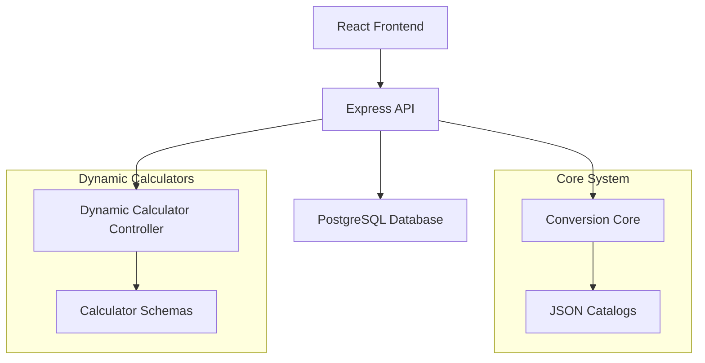

# Resumo Executivo - Implementação das Calculadoras Médicas Health Guardian

## 1. Visão Geral do Projeto

### 1.1 Contexto
O Health Guardian é uma plataforma médica que necessita de um sistema robusto e escalável de calculadoras médicas para apoiar profissionais de saúde em cálculos críticos de infusão, conversões de unidades e dosagens medicamentosas.

### 1.2 Objetivo
Implementar um sistema de calculadoras médicas dinâmicas que:
- Integre backend Node.js/Express com frontend React
- Utilize catálogos JSON para conversões precisas
- Mantenha compatibilidade com o sistema existente
- Forneça interface intuitiva com modo Tap para contagem de gotas
- Garanta precisão e segurança em cálculos médicos críticos

### 1.3 Escopo Prioritário
**Épico 1: Calculadoras de Infusão**
1. Gotas/min ↔ mL/h (com modo Tap)
2. μg/kg/min ↔ mL/h
3. μg/kg/min ↔ gtt/min

**Épico 2: Sistema de Conversões**
1. Conversões dimensionais (massa, volume, tempo)
2. Conversões clínicas (analitos com massa molar)
3. Conversões de valência (mEq/L ↔ mmol/L)

## 2. Arquitetura Técnica

### 2.1 Stack Tecnológico
- **Frontend**: React 18 + Zustand + Tailwind CSS + Vite
- **Backend**: Node.js + Express.js + PostgreSQL
- **Núcleo de Conversão**: JavaScript (adaptado do Python planejado)
- **Validação**: Express-validator + MathJS (modo seguro)
- **Testes**: Jest + React Testing Library

### 2.2 Arquitetura do Sistema


### 2.3 Estrutura de Diretórios
```
backend/src/core/
├── conversion_core.js          # Motor de conversão
├── units/
│   ├── units.factors.json      # Fatores de conversão
│   └── units.synonyms.json     # Sinônimos de unidades
├── analytes/
│   ├── analytes.catalog.json   # Catálogo de analitos
│   └── analytes.synonyms.json  # Sinônimos de analitos
├── calculators/
│   ├── infusion.drops_mlh.json
│   ├── infusion.mcgkgmin_mlh.json
│   └── infusion.mcgkgmin_gttmin.json
└── tests/
    └── *.test.js
```

## 3. Funcionalidades Principais

### 3.1 Sistema de Conversões
- **Conversões Dimensionais**: Via fatores SI com precisão configurável
- **Conversões Clínicas**: Baseadas em massa molar e valência de analitos
- **Conversões Canônicas**: Definidas por especialistas médicos
- **Normalização**: Sinônimos automáticos (mcg → μg, cc → mL)

### 3.2 Calculadoras Dinâmicas
- **Renderização Baseada em Schema**: JSON define interface e lógica
- **Múltiplos Modos**: Cada calculadora pode ter diferentes modos de operação
- **Validação Robusta**: Inputs obrigatórios, limites min/max, tipos de dados
- **Expressões Seguras**: MathJS em modo restrito para cálculos

### 3.3 Modo Tap (Inovação)
- **Contagem Interativa**: Toque na tela para contar gotas
- **Cronômetro Integrado**: Medição automática de tempo
- **Cálculo Automático**: Conversão imediata para mL/h
- **Interface Intuitiva**: Botões grandes e feedback visual

### 3.4 Interface de Usuário
- **Tema Consistente**: Mantém paleta escura/teal existente
- **Responsiva**: Otimizada para desktop e mobile
- **Acessível**: Labels claros, validação em tempo real
- **Cópia Rápida**: Resultados copiáveis com um clique

## 4. Especificações das Calculadoras Prioritárias

### 4.1 Calculadora: Gotas/min ↔ mL/h
**Funcionalidades:**
- Modo Tap para contagem de gotas
- Conversão bidirecional
- Suporte a diferentes fatores de gotejamento (20, 60 gtt/mL)
- Validação de limites seguros

**Fórmulas:**
- `gtt/min = (gotas_contadas) / (tempo_segundos / 60)`
- `mL/h = (gtt/min / fator_gotejamento) * 60`

### 4.2 Calculadora: μg/kg/min ↔ mL/h
**Funcionalidades:**
- Cálculo de taxa de bomba de infusão
- Conversão reversa (taxa → dose)
- Suporte a diferentes concentrações
- Exemplos pré-configurados (Noradrenalina, Dobutamina)

**Fórmulas:**
- `Taxa (mL/h) = (Dose × Peso × 60) / (1000 × Concentração)`
- `Dose (μg/kg/min) = (Taxa × Concentração × 1000) / (60 × Peso)`

### 4.3 Calculadora: μg/kg/min ↔ gtt/min
**Funcionalidades:**
- Infusão gravitacional de drogas vasoativas
- Recomendação de microgotas (60 gtt/mL)
- Cálculo de taxa equivalente em mL/h
- Alertas de segurança

## 5. Plano de Implementação

### 5.1 Cronograma (6 Semanas)

**Fase 1: Infraestrutura Base (Semanas 1-2)**
- ✅ Estrutura de diretórios `/core`
- ✅ Catálogos JSON (unidades, analitos)
- ✅ Motor de conversão JavaScript
- ✅ APIs de conversão
- ✅ Testes unitários básicos

**Fase 2: Calculadoras Dinâmicas (Semanas 3-4)**
- ✅ Controlador de calculadoras dinâmicas
- ✅ Schemas das 3 calculadoras prioritárias
- ✅ Componente React `DynamicCalculator`
- ✅ Implementação do modo Tap
- ✅ Testes de integração

**Fase 3: Integração Frontend (Semana 5)**
- 🔄 Atualização do `calculatorStore`
- 🔄 Integração com interface existente
- 🔄 Sistema de fallback
- 🔄 Histórico de cálculos
- 🔄 Testes de regressão

**Fase 4: Refinamentos (Semana 6)**
- ⏳ Otimizações de performance
- ⏳ Melhorias na UX
- ⏳ Documentação completa
- ⏳ Deploy e monitoramento

### 5.2 Recursos Necessários
- **Desenvolvedor Backend**: 2-3 semanas
- **Desenvolvedor Frontend**: 2-3 semanas
- **QA/Testes**: 1 semana
- **DevOps/Deploy**: 0.5 semana

## 6. Critérios de Sucesso

### 6.1 Funcionalidades Essenciais
- [ ] Conversão de unidades via API (precisão > 99.9%)
- [ ] Calculadoras dinâmicas renderizam corretamente
- [ ] Modo Tap funciona em dispositivos touch
- [ ] Fallback para calculadoras existentes
- [ ] Interface mantém consistência visual
- [ ] Performance: API < 200ms, UI < 1s

### 6.2 Qualidade e Segurança
- [ ] Cobertura de testes > 80%
- [ ] Validação robusta de entrada
- [ ] Sanitização de expressões matemáticas
- [ ] Rate limiting implementado
- [ ] Logs de auditoria funcionais

### 6.3 Usabilidade
- [ ] Interface intuitiva para profissionais de saúde
- [ ] Responsividade em tablets/smartphones
- [ ] Tempo de aprendizado < 5 minutos
- [ ] Feedback visual adequado
- [ ] Tratamento de erros claro

## 7. Riscos e Mitigações

### 7.1 Riscos Técnicos
**Risco**: Precisão de cálculos matemáticos
**Mitigação**: Uso de BigNumber.js, testes extensivos com casos conhecidos

**Risco**: Segurança na avaliação de expressões
**Mitigação**: MathJS em modo restrito, whitelist de funções

**Risco**: Performance com muitas calculadoras
**Mitigação**: Lazy loading, cache de schemas, otimização de queries

### 7.2 Riscos de Negócio
**Risco**: Resistência dos usuários a mudanças
**Mitigação**: Sistema de fallback, migração gradual, treinamento

**Risco**: Validação médica dos cálculos
**Mitigação**: Revisão por especialistas, casos de teste baseados em literatura

## 8. Benefícios Esperados

### 8.1 Para Desenvolvedores
- **Manutenibilidade**: Calculadoras definidas em JSON, não em código
- **Escalabilidade**: Fácil adição de novas calculadoras
- **Testabilidade**: Casos de teste padronizados
- **Reutilização**: Núcleo de conversão compartilhado

### 8.2 Para Usuários Finais
- **Precisão**: Cálculos baseados em padrões médicos
- **Velocidade**: Interface otimizada para uso clínico
- **Confiabilidade**: Validação robusta e tratamento de erros
- **Inovação**: Modo Tap para contagem de gotas

### 8.3 Para o Negócio
- **Diferenciação**: Funcionalidades únicas no mercado
- **Escalabilidade**: Base para expansão futura
- **Qualidade**: Redução de erros médicos
- **Eficiência**: Automação de cálculos complexos

## 9. Próximos Passos Pós-Implementação

### 9.1 Expansão Imediata (3 meses)
1. **Calculadoras de Função Renal**
   - Clearance de creatinina
   - eGFR (CKD-EPI, MDRD)
   - Ajuste de doses por função renal

2. **Calculadoras Pediátricas**
   - Doses por peso/superfície corporal
   - Calculadoras específicas por faixa etária

### 9.2 Melhorias Técnicas (6 meses)
1. **Cache Inteligente**
   - Redis para resultados frequentes
   - Cache de schemas no cliente

2. **Analytics e Monitoramento**
   - Métricas de uso por calculadora
   - Performance monitoring
   - Error tracking e alertas

3. **Otimizações Avançadas**
   - Lazy loading de calculadoras
   - Compressão de responses
   - CDN para assets estáticos

### 9.3 Funcionalidades Avançadas (12 meses)
1. **IA e Machine Learning**
   - Sugestões baseadas em histórico
   - Detecção de padrões de uso
   - Validação automática de resultados

2. **Integração com Sistemas Hospitalares**
   - APIs para EMR/HIS
   - Sincronização de dados de pacientes
   - Relatórios automatizados

## 10. Conclusão

A implementação das calculadoras médicas do Health Guardian representa um avanço significativo na digitalização de processos clínicos críticos. O sistema proposto combina:

- **Precisão Técnica**: Núcleo de conversão robusto baseado em padrões internacionais
- **Flexibilidade**: Arquitetura dinâmica que permite fácil expansão
- **Usabilidade**: Interface otimizada para o ambiente clínico
- **Inovação**: Funcionalidades únicas como o modo Tap
- **Segurança**: Validação rigorosa e tratamento de erros

O projeto está bem estruturado com documentação completa, plano de implementação detalhado e critérios de sucesso claros. A execução em 4 fases permite entrega incremental de valor e redução de riscos.

**Recomendação**: Proceder com a implementação conforme planejado, priorizando as calculadoras de infusão que têm maior impacto clínico e diferenciação competitiva.

---

## 11. Documentos de Referência

### 11.1 Documentos Criados
1. **health-guardian-calculadoras-prd.md** - Requisitos de produto
2. **health-guardian-calculadoras-arquitetura-tecnica.md** - Arquitetura técnica detalhada
3. **health-guardian-calculadoras-especificacoes-implementacao.md** - Especificações técnicas completas
4. **health-guardian-calculadoras-guia-implementacao.md** - Guia passo a passo
5. **health-guardian-calculadoras-resumo-executivo.md** - Este documento

### 11.2 Documentos de Planejamento Analisados
- `progredindo.md` - Backlog estruturado e arquitetura proposta
- `calcGPT.txt` - Organização hierárquica das calculadoras
- Arquivos PDF de construção de módulos (4-15)
- Estrutura atual do projeto (frontend/backend)

### 11.3 Código Fonte Analisado
- `calculatorStore.js` - Store Zustand existente
- `Calculators.jsx` - Componente principal de calculadoras
- `calculator.controller.js` - Controlador backend existente
- `Calculator.js` - Modelo Sequelize existente

---

**Status**: ✅ Documentação Completa  
**Data**: Janeiro 2024  
**Versão**: 1.0.0  
**Aprovação**: Pendente revisão técnica