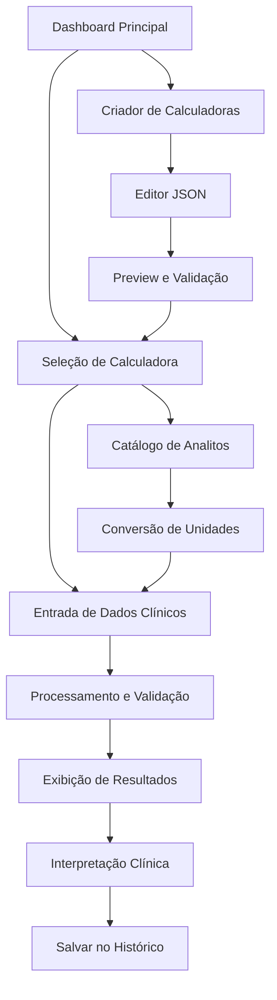

# Plano de Expansão do Sistema de Calculadoras Médicas

## 1. Visão Geral do Projeto

Este documento detalha a expansão do sistema de calculadoras médicas existente, focando em três pilares principais: expansão de catálogos de analitos e unidades, implementação de calculadoras adicionais essenciais, e otimização da interface para dispositivos móveis. O sistema atual possui 3 calculadoras pré-construídas (Conversão de Gotejamento, Conversão mcg/kg/min, e calculadoras dinâmicas) que servirão como base arquitetural para as novas implementações.

## 2. Funcionalidades Principais

### 2.1 Papéis de Usuário
| Papel | Método de Registro | Permissões Principais |
|-------|-------------------|----------------------|
| Usuário Médico | Registro por email profissional | Acesso completo às calculadoras, criação de calculadoras personalizadas |
| Usuário Estudante | Registro acadêmico | Acesso às calculadoras básicas e educacionais |
| Administrador | Convite interno | Gerenciamento de catálogos, aprovação de calculadoras |

### 2.2 Módulos de Funcionalidade

Nosso sistema expandido consistirá dos seguintes módulos principais:

1. **Catálogo de Analitos**: Base de dados expandida com 12 famílias de analitos médicos
2. **Sistema de Unidades**: Conversor universal para unidades médicas e farmacológicas
3. **Calculadoras Dinâmicas**: Sistema flexível baseado em JSON para novas calculadoras
4. **Calculadoras Pré-construídas**: Componentes React otimizados para cálculos frequentes
5. **Interface Mobile**: Layout responsivo com otimizações touch-first

### 2.3 Detalhes das Páginas

| Nome da Página | Nome do Módulo | Descrição da Funcionalidade |
|----------------|----------------|-----------------------------|
| Dashboard Principal | Painel de Calculadoras | Exibe grid responsivo com todas as calculadoras disponíveis, filtros por categoria médica, busca inteligente |
| Calculadora Individual | Motor de Cálculo | Executa cálculos médicos com validação de entrada, exibe fórmulas, referências bibliográficas, histórico de cálculos |
| Catálogo de Analitos | Base de Conhecimento | Navega por famílias de analitos, conversões de unidades, fatores de conversão SI |
| Criador de Calculadoras | Editor JSON | Interface para criação de novas calculadoras dinâmicas, validação de esquemas, preview em tempo real |
| Configurações Mobile | Otimização UX | Ajustes de interface para dispositivos móveis, modo offline, sincronização |

## 3. Fluxo Principal de Uso

O usuário médico acessa o dashboard principal, seleciona uma calculadora por categoria ou busca, insere os valores clínicos necessários, visualiza o resultado com interpretação clínica e referências, e pode salvar o cálculo no histórico pessoal.



## 4. Design da Interface

### 4.1 Estilo de Design

- **Cores Primárias**: Azul médico (#2563EB), Verde saúde (#059669)
- **Cores Secundárias**: Cinza neutro (#6B7280), Branco clínico (#FFFFFF)
- **Estilo de Botões**: Rounded-lg com sombras sutis, estados hover/active bem definidos
- **Tipografia**: Inter para interface (14px-18px), JetBrains Mono para valores numéricos
- **Layout**: Card-based com grid responsivo, navegação top-level fixa
- **Ícones**: Lucide React com tema médico, tamanho 20px-24px

### 4.2 Visão Geral do Design das Páginas

| Nome da Página | Nome do Módulo | Elementos de UI |
|----------------|----------------|----------------|
| Dashboard Principal | Grid de Calculadoras | Layout em cards 3x3 (desktop) / 1x1 (mobile), cores categorizadas por especialidade, ícones médicos, busca com autocomplete |
| Calculadora Individual | Formulário de Entrada | Campos de input com validação em tempo real, labels com tooltips explicativos, botão de cálculo destacado, área de resultados com tipografia mono |
| Catálogo de Analitos | Tabela Expandível | Accordion por família de analitos, tabela responsiva com filtros, badges para unidades, links para conversores |
| Criador de Calculadoras | Editor Split-View | Painel esquerdo com editor JSON syntax-highlighted, painel direito com preview ao vivo, toolbar com validação |

### 4.3 Responsividade

O sistema será mobile-first com breakpoints em 640px (sm), 768px (md), 1024px (lg). Otimizações incluem touch targets de 44px mínimo, gestos swipe para navegação, modo offline com cache local, e sincronização automática quando online.

## 5. Expansão de Catálogos

### 5.1 Analitos Expandidos

Baseado na análise dos módulos existentes, implementaremos 12 famílias de analitos:

**Eletrólitos**: Sódio, Potássio, Cloro, Bicarbonato, Cálcio, Magnésio, Fosfato
- Aplicação: Fórmulas de osmolaridade, correção de cálcio, balanço ácido-base
- Unidades: mEq/L, mmol/L, mg/dL
- Fatores de conversão: Na+ (mg/dL × 0.435 = mmol/L)

**Metabólitos**: Glicose, Ureia, Creatinina, Ácido úrico
- Aplicação: Clearance renal, correção de sódio, estimativa de TFG
- Unidades: mg/dL, mmol/L, μmol/L
- Fatores de conversão: Glicose (mg/dL × 0.0551 = mmol/L), Creatinina (mg/dL × 88.4 = μmol/L)

**Lipídios**: Colesterol total, LDL, HDL, Triglicerídeos
- Aplicação: Fórmula de Friedewald, escores de risco cardiovascular
- Unidades: mg/dL, mmol/L
- Fatores de conversão: Colesterol (mg/dL × 0.0259 = mmol/L)

**Enzimas Hepáticas**: ALT, AST, ALP, GGT, Bilirrubina
- Aplicação: Escores Child-Pugh, MELD, avaliação hepática
- Unidades: U/L, mg/dL, μmol/L
- Fatores de conversão: Bilirrubina (mg/dL × 17.1 = μmol/L)

**Hormônios**: TSH, T4 livre, Cortisol, Insulina
- Aplicação: Avaliação endócrina, ajustes terapêuticos
- Unidades: mU/L, pmol/L, ng/mL, μU/mL
- Fatores de conversão: T4 livre (ng/dL × 12.87 = pmol/L)

**Vitaminas**: 25-OH Vitamina D, B12, Ácido fólico
- Aplicação: Deficiências nutricionais, suplementação
- Unidades: ng/mL, nmol/L, pg/mL
- Fatores de conversão: Vit D (ng/mL × 2.5 = nmol/L)

**Marcadores Inflamatórios**: PCR, Ferritina
- Aplicação: Monitoramento inflamatório, reservas de ferro
- Unidades: mg/L, ng/mL, μg/L
- Fatores de conversão: PCR (mg/L = mg/dL × 10)

**Catecolaminas**: Epinefrina, Norepinefrina, Dopamina
- Aplicação: Diagnóstico de feocromocitoma, infusões vasoativas
- Unidades: pg/mL, nmol/L, μg/kg/min
- Fatores de conversão: Epinefrina (pg/mL × 5.46 = nmol/L)

**Gases Sanguíneos**: PaO2, PaCO2, pH, Lactato
- Aplicação: Gasometria arterial, ventilação mecânica
- Unidades: mmHg, kPa, mmol/L
- Fatores de conversão: PaO2 (mmHg × 0.133 = kPa)

**Hematologia**: Hemoglobina, Hematócrito, Leucócitos, Plaquetas
- Aplicação: Anemia, coagulopatias, infecções
- Unidades: g/dL, %, ×10³/μL, ×10⁹/L
- Fatores de conversão: Hb (g/dL × 10 = g/L)

**Marcadores Cardíacos**: Troponina, CK-MB, BNP, NT-proBNP
- Aplicação: Infarto do miocárdio, insuficiência cardíaca
- Unidades: ng/mL, μg/L, pg/mL
- Fatores de conversão: Troponina (ng/mL = μg/L)

**Outros Marcadores**: Homocisteína, PTH, Procalcitonina
- Aplicação: Risco cardiovascular, metabolismo ósseo, sepsis
- Unidades: μmol/L, pg/mL, ng/mL
- Fatores de conversão: Homocisteína (mg/L × 7.4 = μmol/L)

### 5.2 Sistema de Unidades Expandido

**Massa**: μg, mg, g, kg com conversões automáticas
**Volume**: μL, mL, L com suporte a unidades compostas (mL/kg/h)
**Concentração**: Suporte completo para mg/dL ↔ mmol/L com base molecular
**Atividade Enzimática**: U/L, kU/L, μkat/L com equivalências
**Pressão**: mmHg, kPa, cmH2O para gasometria e hemodinâmica
**Tempo**: s, min, h, dias para farmacocinética
**Taxas**: gtt/min, mL/h, μg/kg/min para infusões
**Contagens Celulares**: células/μL, ×10⁹/L, % para hematologia

## 6. Calculadoras Adicionais

### 6.1 Calculadoras Antropométricas

**Índice de Massa Corporal (IMC)**
- Entrada: Peso (kg), Altura (m)
- Fórmula: IMC = peso ÷ altura²
- Saída: Valor numérico + classificação (baixo peso, normal, sobrepeso, obesidade)
- Validação médica: Faixas etárias específicas, considerações pediátricas
- Referências: OMS, CDC

**Área de Superfície Corporal (BSA) - Mosteller**
- Entrada: Altura (cm), Peso (kg)
- Fórmula: BSA = √((altura × peso)/3600)
- Saída: m² com precisão de 2 casas decimais
- Validação médica: Aplicável para dosagem de quimioterápicos
- Referências: Mosteller RD, 1987

**Área de Superfície Corporal (BSA) - DuBois**
- Entrada: Altura (m), Peso (kg)
- Fórmula: BSA = 0.20247 × altura^0.725 × peso^0.425
- Saída: m² com comparação Mosteller
- Validação médica: Padrão histórico, menos usado atualmente
- Referências: DuBois & DuBois, 1916

**Peso Corporal Ideal (Devine)**
- Entrada: Altura (cm), Sexo
- Fórmula: Homens = 50 + 0.9×(altura-152), Mulheres = 45.5 + 0.9×(altura-152)
- Saída: kg com interpretação clínica
- Validação médica: Base para dosagem de medicamentos
- Referências: Devine BJ, 1974

**Peso Corporal Magro (Hume)**
- Entrada: Altura (cm), Peso (kg), Sexo
- Fórmula: Homens = 0.3281×peso + 0.33929×altura - 29.5336
- Saída: kg de massa magra
- Validação médica: Farmacocinética de drogas hidrofílicas
- Referências: Hume R, 1966

**Peso Corporal Ajustado**
- Entrada: Peso atual (kg), Peso ideal (kg)
- Fórmula: AjBW = IBW + 0.4×(peso_atual - IBW)
- Saída: kg para dosagem farmacológica
- Validação médica: Pacientes obesos, dosagem de aminoglicosídeos
- Referências: Traynor et al, 1995

### 6.2 Calculadoras de Função Renal

**Clearance de Creatinina (Cockcroft-Gault)**
- Entrada: Idade (anos), Peso (kg), Creatinina sérica (mg/dL), Sexo
- Fórmula: CrCl = [(140-idade)×peso]/(72×Cr) × 0.85 (se mulher)
- Saída: mL/min com classificação de função renal
- Validação médica: Padrão para ajuste de doses renais
- Referências: Cockcroft & Gault, 1976

**Taxa de Filtração Glomerular (CKD-EPI 2021)**
- Entrada: Creatinina sérica (mg/dL), Idade (anos), Sexo
- Fórmula: Equação CKD-EPI sem correção racial
- Saída: mL/min/1.73m² com estágio de DRC
- Validação médica: Padrão atual para classificação de DRC
- Referências: Inker et al, 2021

**Clearance de Creatinina Medido**
- Entrada: Volume urinário (mL), Tempo de coleta (min), Creatinina urinária (mg/dL), Creatinina sérica (mg/dL)
- Fórmula: CrCl = (Cr_urina × volume)/(Cr_sérica × tempo)
- Saída: mL/min normalizado
- Validação médica: Padrão-ouro para função renal
- Referências: Levey et al, 2009

**Fração de Excreção de Sódio (FeNa)**
- Entrada: Sódio urinário (mEq/L), Creatinina sérica (mg/dL), Sódio sérico (mEq/L), Creatinina urinária (mg/dL)
- Fórmula: FeNa = [(Na_urina × Cr_sérica)/(Na_sérica × Cr_urina)] × 100
- Saída: % com interpretação diagnóstica
- Validação médica: Diferenciação entre IRA pré-renal e intrínseca
- Referências: Espinel CH, 1976

**Fração de Excreção de Ureia (FeUrea)**
- Entrada: Ureia urinária (mg/dL), Creatinina sérica (mg/dL), Ureia sérica (mg/dL), Creatinina urinária (mg/dL)
- Fórmula: FeUrea = [(Ureia_urina × Cr_sérica)/(Ureia_sérica × Cr_urina)] × 100
- Saída: % com interpretação clínica
- Validação médica: Útil em pacientes usando diuréticos
- Referências: Carvounis et al, 2002

### 6.3 Calculadoras Metabólicas

**Correção de Cálcio pela Albumina**
- Entrada: Cálcio sérico total (mg/dL), Albumina (g/dL)
- Fórmula: Ca_corr = Ca_total + 0.8×(4.0 - albumina)
- Saída: mg/dL corrigido
- Validação médica: Essencial em hipoalbuminemia
- Referências: Payne et al, 1973

**Osmolaridade Sérica Calculada**
- Entrada: Sódio (mEq/L), Glicose (mg/dL), Ureia (mg/dL)
- Fórmula: Osm = 2×Na + glicose/18 + ureia/6
- Saída: mOsm/kg com gap osmótico
- Validação médica: Avaliação de intoxicações
- Referências: Dorwart & Chalmers, 1975

**Correção de Sódio por Hiperglicemia**
- Entrada: Sódio medido (mEq/L), Glicemia (mg/dL)
- Fórmula: Na_corr = Na_medido + 1.6×[(glicemia-100)/100]
- Saída: mEq/L corrigido
- Validação médica: Hiperglicemia severa, cetoacidose
- Referências: Katz MA, 1973

**Déficit de Ferro (Ganzoni)**
- Entrada: Peso (kg), Hb alvo (g/dL), Hb atual (g/dL), Ferro de depósito (mg)
- Fórmula: Déficit = peso×(Hb_alvo-Hb_atual)×2.4 + ferro_depósito
- Saída: mg de ferro total
- Validação médica: Reposição de ferro IV
- Referências: Ganzoni AM, 1970

**Estimativa Média de Glicemia (eAG)**
- Entrada: HbA1c (%)
- Fórmula: eAG = 28.7×HbA1c - 46.7
- Saída: mg/dL equivalente
- Validação médica: Interpretação de HbA1c
- Referências: Nathan et al, 2008

### 6.4 Calculadoras Cardiológicas

**LDL Colesterol (Friedewald)**
- Entrada: Colesterol total (mg/dL), HDL (mg/dL), Triglicerídeos (mg/dL)
- Fórmula: LDL = CT - HDL - TG/5
- Saída: mg/dL com limitações
- Validação médica: Inválido se TG > 400 mg/dL
- Referências: Friedewald et al, 1972

**Relação PaO2/FiO2**
- Entrada: PaO2 (mmHg), FiO2 (fração)
- Fórmula: Relação = PaO2/FiO2
- Saída: mmHg com classificação SARA
- Validação médica: Diagnóstico de SARA/ARDS
- Referências: Bernard et al, 1994

### 6.5 Calculadoras Hematológicas

**Contagem Absoluta de Eosinófilos**
- Entrada: Leucócitos totais (×10³/μL), % Eosinófilos
- Fórmula: Eosinófilos absolutos = (WBC × %Eo)/100
- Saída: células/μL com interpretação
- Validação médica: Diagnóstico de eosinofilia
- Referências: Tefferi A, 2005

**Saturação de Transferrina**
- Entrada: Ferro sérico (μg/dL), TIBC (μg/dL)
- Fórmula: IST = (ferro/TIBC) × 100
- Saída: % com interpretação
- Validação médica: Diagnóstico de deficiência de ferro
- Referências: Looker et al, 1997

### 6.6 Calculadoras de Terapia Intensiva

**PaO2 Ideal pela Idade**
- Entrada: Idade (anos)
- Fórmula: PaO2_ideal = 100 - (idade/3)
- Saída: mmHg esperado
- Validação médica: Referência para gasometria
- Referências: Sorbini et al, 1968

**Relação SpO2/FiO2**
- Entrada: SpO2 (%), FiO2 (fração)
- Fórmula: Relação = SpO2/FiO2
- Saída: Estimativa de PaO2/FiO2
- Validação médica: Quando gasometria não disponível
- Referências: Rice et al, 2007

## 7. Otimização Mobile

### 7.1 Estratégia Mobile-First

**Breakpoints Responsivos**:
- Mobile: 320px-640px (sm)
- Tablet: 641px-1024px (md)
- Desktop: 1025px+ (lg)

**Layout Adaptativo**:
- Grid 1×1 em mobile, 2×2 em tablet, 3×3 em desktop
- Stack vertical de formulários em mobile
- Navegação bottom-tab em mobile, top-nav em desktop

**Touch Optimization**:
- Targets mínimos de 44px×44px
- Espaçamento entre elementos de 8px mínimo
- Gestos swipe para navegação entre calculadoras
- Pull-to-refresh para atualização de dados

### 7.2 Performance Mobile

**Lazy Loading**:
- Calculadoras carregadas sob demanda
- Imagens e ícones otimizados (WebP, SVG)
- Code splitting por categoria médica

**Caching Strategy**:
- Service Worker para cache de calculadoras
- LocalStorage para histórico de cálculos
- IndexedDB para catálogo de analitos offline

**Network Optimization**:
- API calls batched quando possível
- Retry logic para conexões instáveis
- Offline-first para calculadoras básicas

### 7.3 UX Mobile Específico

**Input Optimization**:
- Teclados numéricos para campos numéricos
- Autocomplete para seleção de analitos
- Validação em tempo real com feedback visual

**Navigation Patterns**:
- Bottom navigation com 4 tabs principais
- Floating Action Button para nova calculadora
- Breadcrumbs colapsáveis em mobile

**Feedback Systems**:
- Haptic feedback para ações importantes
- Toast notifications não-intrusivas
- Loading states com skeleton screens

## 8. Arquitetura Técnica

### 8.1 Frontend (React + TypeScript)

**Estrutura de Componentes**:
```
src/
├── components/
│   ├── calculators/
│   │   ├── PreBuilt/
│   │   │   ├── BMICalculator.tsx
│   │   │   ├── BSACalculator.tsx
│   │   │   ├── CockcroftGaultCalculator.tsx
│   │   │   └── FriedewaldCalculator.tsx
│   │   ├── Dynamic/
│   │   │   └── DynamicCalculator.tsx
│   │   └── Common/
│   │       ├── CalculatorCard.tsx
│   │       ├── FormulaDisplay.tsx
│   │       └── ResultsPanel.tsx
│   ├── catalogs/
│   │   ├── AnalytesCatalog.tsx
│   │   ├── UnitConverter.tsx
│   │   └── ConversionTable.tsx
│   └── mobile/
│       ├── MobileNavigation.tsx
│       ├── TouchOptimizedInput.tsx
│       └── SwipeableCalculator.tsx
```

**State Management (Zustand)**:
```typescript
interface CalculatorStore {
  calculators: Calculator[];
  analytes: Analyte[];
  units: Unit[];
  history: CalculationHistory[];
  addCalculation: (calc: Calculation) => void;
  convertUnit: (value: number, from: Unit, to: Unit) => number;
}
```

**Hooks Customizados**:
- `useCalculator`: Lógica de cálculo e validação
- `useUnitConverter`: Conversões automáticas
- `useMobileDetection`: Otimizações mobile
- `useOfflineSync`: Sincronização offline

### 8.2 Backend Integration

**API Endpoints**:
```
GET /api/calculators - Lista todas as calculadoras
POST /api/calculators/:id/calculate - Executa cálculo
GET /api/analytes - Catálogo de analitos
GET /api/units/convert - Conversão de unidades
POST /api/history - Salva histórico de cálculo
```

**Validation Schema**:
```typescript
interface CalculatorInput {
  id: string;
  name: string;
  domain: string;
  inputs: InputField[];
  formula: string;
  references: Reference[];
}

interface InputField {
  name: string;
  symbol: string;
  type: 'number' | 'string' | 'select';
  unit?: string;
  validation: ValidationRule[];
}
```

### 8.3 Data Models

**Calculator Schema**:
```json
{
  "name": "Índice de Massa Corporal",
  "domain": "antropometria",
  "description": "Calcula IMC e classifica estado nutricional",
  "inputs": [
    {
      "name": "peso",
      "symbol": "weight_kg",
      "type": "number",
      "unit": "kg",
      "validation": {"min": 1, "max": 500}
    },
    {
      "name": "altura",
      "symbol": "height_m",
      "type": "number",
      "unit": "m",
      "validation": {"min": 0.3, "max": 3.0}
    }
  ],
  "output": {
    "name": "imc",
    "unit": "kg/m²",
    "interpretation": {
      "<18.5": "Baixo peso",
      "18.5-24.9": "Peso normal",
      "25.0-29.9": "Sobrepeso",
      "≥30.0": "Obesidade"
    }
  },
  "formula": "IMC = peso ÷ altura²",
  "references": [
    {"citation": "WHO BMI Classification", "url": "https://www.who.int/news-room/fact-sheets/detail/obesity-and-overweight"}
  ]
}
```

**Analyte Schema**:
```json
{
  "name": "Glicose",
  "family": "metabólitos",
  "units": [
    {"name": "mg/dL", "si": false, "factor": 1},
    {"name": "mmol/L", "si": true, "factor": 0.0551}
  ],
  "reference_ranges": {
    "normal": {"min": 70, "max": 100, "unit": "mg/dL"},
    "diabetes": {"min": 126, "unit": "mg/dL"}
  }
}
```

## 9. Implementação por Fases

### Fase 1: Expansão de Catálogos (Semanas 1-2)

**Entregáveis**:
- Base de dados de analitos expandida (12 famílias)
- Sistema de conversão de unidades universal
- Interface de catálogo navegável
- Testes unitários para conversões

**Critérios de Aceitação**:
- 200+ analitos catalogados com fatores de conversão
- Conversões bidirecionais funcionando (convencional ↔ SI)
- Interface responsiva para navegação do catálogo
- Validação médica de todas as conversões

### Fase 2: Calculadoras Antropométricas (Semanas 3-4)

**Entregáveis**:
- IMC com classificação automática
- BSA (Mosteller e DuBois)
- Peso ideal, magro e ajustado
- Componentes React otimizados
- Integração com sistema existente

**Critérios de Aceitação**:
- 6 calculadoras antropométricas funcionais
- Validação de entrada com feedback em tempo real
- Interpretação clínica automática
- Layout consistente com calculadoras existentes

### Fase 3: Calculadoras Renais (Semanas 5-6)

**Entregáveis**:
- Cockcroft-Gault e CKD-EPI 2021
- Clearance medido e frações de excreção
- Classificação automática de função renal
- Alertas para valores críticos

**Critérios de Aceitação**:
- 5 calculadoras renais com validação médica
- Classificação automática de estágios de DRC
- Interpretação diagnóstica para FeNa/FeUrea
- Integração com catálogo de analitos

### Fase 4: Calculadoras Metabólicas e Especializadas (Semanas 7-8)

**Entregáveis**:
- Correções metabólicas (cálcio, sódio, osmolaridade)
- Calculadoras hematológicas e cardiológicas
- Calculadoras de terapia intensiva
- Sistema de referências bibliográficas

**Critérios de Aceitação**:
- 12 calculadoras especializadas funcionais
- Sistema de referências com links externos
- Validação clínica rigorosa
- Alertas para limitações das fórmulas

### Fase 5: Otimização Mobile (Semanas 9-10)

**Entregáveis**:
- Layout responsivo mobile-first
- Navegação touch-optimized
- Performance otimizada
- Modo offline básico

**Critérios de Aceitação**:
- Interface totalmente responsiva (320px+)
- Touch targets ≥44px
- Tempo de carregamento <3s em 3G
- Funcionalidade offline para calculadoras básicas

### Fase 6: Testes e Refinamentos (Semanas 11-12)

**Entregáveis**:
- Testes automatizados completos
- Validação médica por especialistas
- Documentação técnica
- Treinamento de usuários

**Critérios de Aceitação**:
- Cobertura de testes >90%
- Validação médica aprovada
- Documentação completa
- Performance otimizada

## 10. Validação Médica

### 10.1 Critérios de Validação

**Precisão das Fórmulas**:
- Verificação com literatura médica atual
- Comparação com calculadoras de referência
- Validação de ranges de entrada
- Teste com casos clínicos reais

**Interpretação Clínica**:
- Classificações baseadas em guidelines
- Alertas para valores críticos
- Limitações claramente documentadas
- Contexto clínico apropriado

**Referências Bibliográficas**:
- Citações de artigos originais
- Guidelines de sociedades médicas
- Links para fontes confiáveis
- Data de última atualização

### 10.2 Processo de Revisão

**Revisão Técnica**:
1. Implementação da fórmula
2. Validação de entrada/saída
3. Testes com casos conhecidos
4. Verificação de edge cases

**Revisão Médica**:
1. Precisão clínica da fórmula
2. Adequação da interpretação
3. Contexto de uso apropriado
4. Limitações bem documentadas

**Revisão de Usabilidade**:
1. Interface intuitiva
2. Feedback claro ao usuário
3. Prevenção de erros
4. Acessibilidade

## 11. Métricas de Sucesso

### 11.1 Métricas Técnicas
- Tempo de carregamento <3s (mobile 3G)
- Uptime >99.5%
- Cobertura de testes >90%
- Zero erros críticos de cálculo

### 11.2 Métricas de Usabilidade
- Taxa de conclusão de cálculos >95%
- Tempo médio por cálculo <2min
- Taxa de erro de entrada <5%
- Satisfação do usuário >4.5/5

### 11.3 Métricas de Adoção
- 50+ calculadoras implementadas
- 200+ analitos catalogados
- 100% das calculadoras mobile-optimized
- 80% dos usuários usando mobile

## 12. Riscos e Mitigações

### 12.1 Riscos Técnicos
**Risco**: Erros de cálculo médico
**Mitigação**: Validação rigorosa, testes automatizados, revisão médica

**Risco**: Performance em mobile
**Mitigação**: Lazy loading, caching, otimização de bundle

**Risco**: Compatibilidade de unidades
**Mitigação**: Sistema de conversão robusto, validação de entrada

### 12.2 Riscos Médicos
**Risco**: Interpretação clínica incorreta
**Mitigação**: Revisão por especialistas, disclaimers claros

**Risco**: Uso inadequado de fórmulas
**Mitigação**: Documentação de limitações, alertas contextuais

**Risco**: Dados desatualizados
**Mitigação**: Processo de atualização regular, versionamento

### 12.3 Riscos de Projeto
**Risco**: Atraso na implementação
**Mitigação**: Desenvolvimento incremental, MVP approach

**Risco**: Complexidade excessiva
**Mitigação**: Priorização rigorosa, feedback contínuo

**Risco**: Adoção baixa
**Mitigação**: UX research, treinamento, feedback dos usuários

## 13. Conclusão

Este plano de expansão transformará o sistema atual de 3 calculadoras em uma plataforma médica abrangente com 50+ calculadoras, catálogo expandido de analitos e interface mobile-first. A implementação seguirá uma abordagem incremental e validada medicamente, garantindo precisão clínica e usabilidade excepcional.

O sucesso do projeto dependerá da execução rigorosa das fases planejadas, validação médica contínua e foco na experiência do usuário mobile. Com esta expansão, o sistema se tornará uma ferramenta indispensável para profissionais de saúde em diversos contextos clínicos.