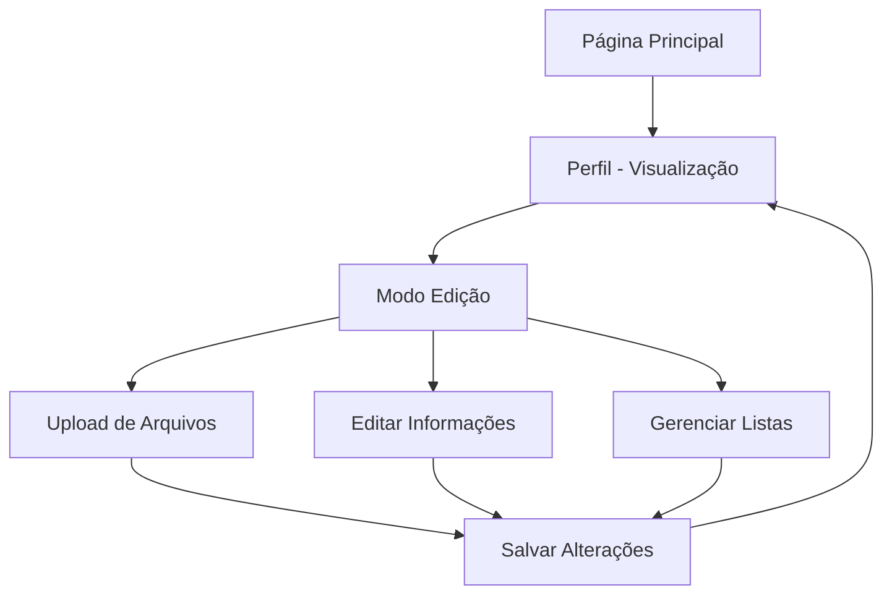

# Documento de Requisitos do Produto - Página de Perfil Profissional

## 1. Visão Geral do Produto

Página de perfil profissional completa para médicos no sistema Health Guardian, projetada para integração futura com marketplace de consultas. Permite visualização e edição de informações profissionais, upload de documentos e preparação para agendamento de consultas.

O sistema resolve a necessidade de médicos apresentarem suas credenciais de forma profissional e organizarem informações para futura integração com marketplace, onde pacientes poderão encontrar e agendar consultas diretamente.

## 2. Funcionalidades Principais

### 2.1 Papéis de Usuário

| Papel | Método de Registro | Permissões Principais |
|-------|-------------------|----------------------|
| Médico Autenticado | Login com email/senha existente | Visualizar e editar perfil completo, upload de arquivos |

### 2.2 Módulo de Funcionalidades

Nossos requisitos de perfil profissional consistem nas seguintes páginas principais:

1. **Página de Perfil**: visualização pública, modo de edição, upload de arquivos, gerenciamento de informações profissionais.

### 2.3 Detalhes das Páginas

| Nome da Página | Nome do Módulo | Descrição da Funcionalidade |
|----------------|----------------|-----------------------------|
| Página de Perfil | Visualização Pública | Exibir informações como cartão de visita profissional: foto, nome, título, especialidade, biografia |
| Página de Perfil | Modo de Edição | Editar informações pessoais: nome, título profissional, especialidade, biografia, formação acadêmica, experiências |
| Página de Perfil | Upload de Arquivos | Upload de foto de perfil (avatar) e currículo em PDF/DOC com validação de formato e tamanho |
| Página de Perfil | Gerenciamento de Listas | Adicionar, editar e remover itens de formação acadêmica e experiências profissionais |
| Página de Perfil | Integração Marketplace | Preparar dados para futura integração: disponibilidade, localização, especialidades para agendamento |

## 3. Processo Principal

### Fluxo do Médico Autenticado

1. **Acesso**: Médico clica no link de perfil na navegação principal
2. **Visualização**: Sistema exibe perfil no modo de visualização pública (como marketplace verá)
3. **Edição**: Médico pode alternar para modo de edição via botão "Editar Perfil"
4. **Modificação**: Médico atualiza informações, adiciona formação/experiências, faz upload de arquivos
5. **Salvamento**: Sistema valida e salva alterações, exibe confirmação
6. **Retorno**: Médico retorna à visualização pública com dados atualizados

## 4. Design da Interface do Usuário

### 4.1 Estilo de Design

- **Cores Primárias**: Tema dark (#1a1a1a fundo, #2a2a2a cards) e bright (#ffffff fundo, #f8f9fa cards)
- **Cores Secundárias**: Teal (#14b8a6) para acentos, cinza (#6b7280) para texto secundário
- **Estilo de Botões**: Arredondados com transições suaves, variantes default/outline/ghost
- **Fonte**: Sistema padrão com tamanhos sm (14px), base (16px), lg (18px), xl (20px)
- **Layout**: Baseado em cards com navegação por tabs, responsivo mobile-first
- **Ícones**: Lucide React para consistência, estilo outline

### 4.2 Visão Geral do Design das Páginas

| Nome da Página | Nome do Módulo | Elementos da UI |
|----------------|----------------|----------------|
| Página de Perfil | Header de Perfil | Avatar circular (150px), nome (text-2xl), título profissional (text-lg), especialidade (badge teal) |
| Página de Perfil | Navegação por Tabs | Tabs: "Visualizar", "Editar", "Document