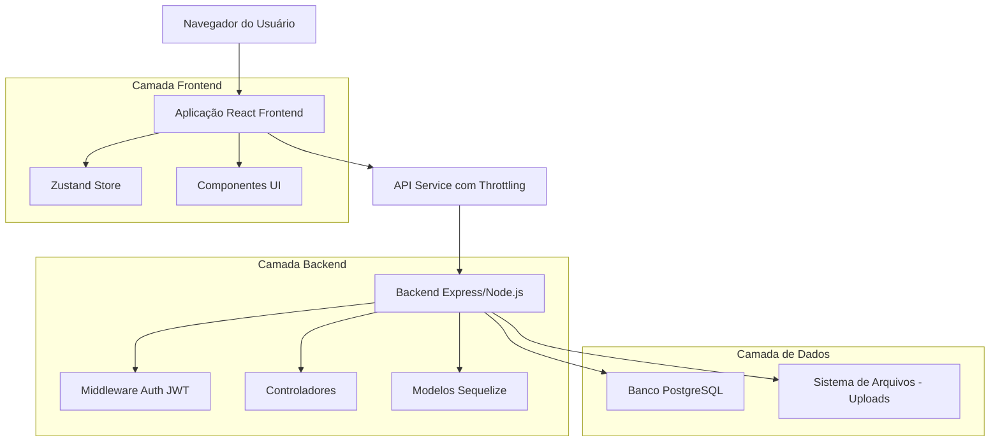
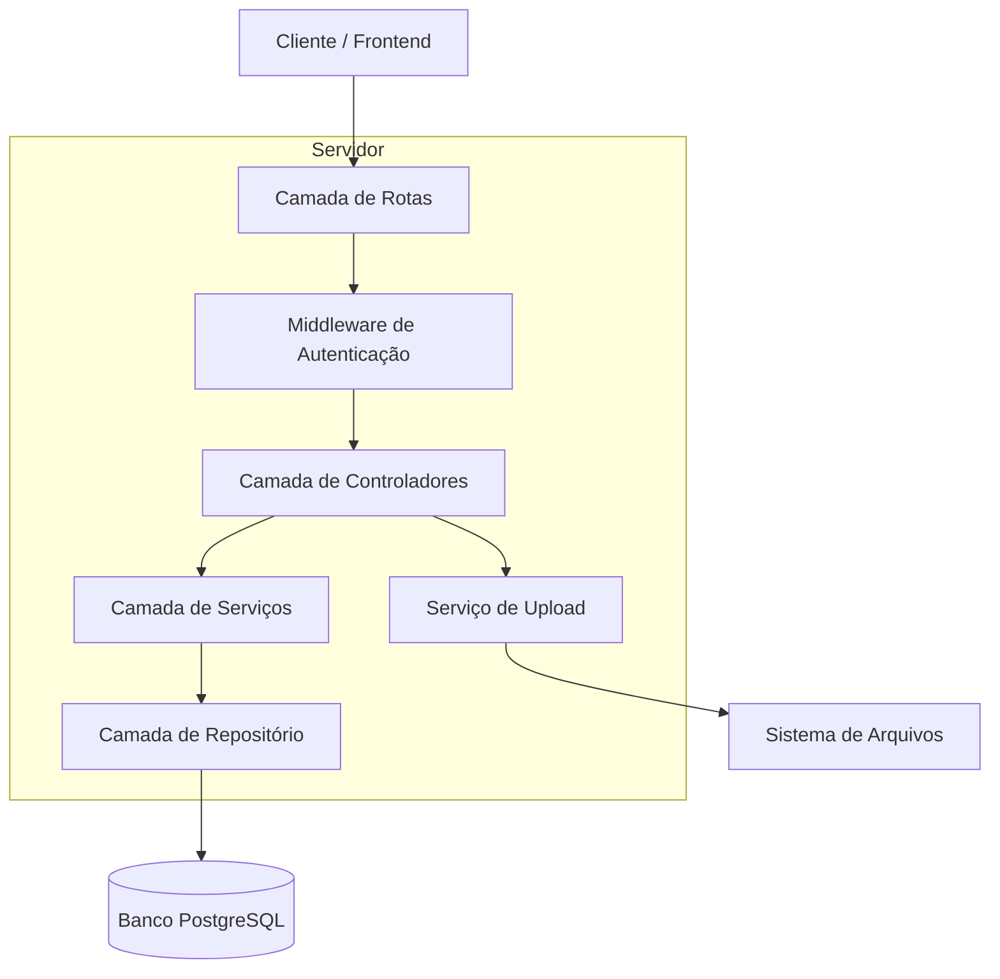
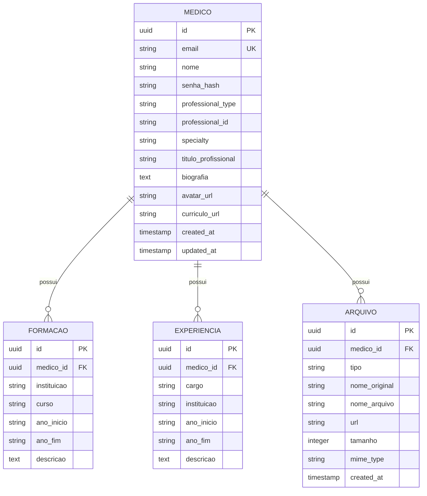

# Documento de Arquitetura Técnica - Página de Perfil Profissional

## 1. Design da Arquitetura



## 2. Descrição das Tecnologias

* **Frontend**: React\@18 + Tailwind CSS\@3 + Vite + Zustand

* **Backend**: Node.js + Express\@4 + Sequelize ORM

* **Banco de Dados**: PostgreSQL (via Supabase)

* **Autenticação**: JWT com modelo Medico existente

* **Upload de Arquivos**: Multer + validação de tipos

* **UI Components**: Shadcn/ui + Lucide React icons

## 3. Definições de Rotas

| Rota                   | Propósito                                                               |
| ---------------------- | ----------------------------------------------------------------------- |
| /profile               | Página principal do perfil profissional com tabs de visualização/edição |
| /profile?tab=view      | Visualização pública do perfil (modo marketplace)                       |
| /profile?tab=edit      | Modo de edição do perfil com formulários                                |
| /profile?tab=documents | Gerenciamento de documentos (avatar, currículo)                         |

## 4. Definições de API

### 4.1 APIs Principais

**Obter perfil do médico autenticado**

```
GET /api/auth/profile
```

Request: Nenhum parâmetro (usa token JWT)

Response:

| Nome do Parâmetro    | Tipo          | Descrição                           |
| -------------------- | ------------- | ----------------------------------- |
| id                   | string (UUID) | ID único do médico                  |
| nome                 | string        | Nome completo                       |
| email                | string        | Email de contato                    |
| professional\_type   | string        | Tipo profissional (médico)          |
| professional\_id     | string        | CRM ou registro profissional        |
| specialty            | string        | Especialidade médica                |
| titulo\_profissional | string        | Título profissional                 |
| biografia            | text          | Biografia/apresentação              |
| avatar\_url          | string        | URL da foto de perfil               |
| curriculo\_url       | string        | URL do currículo                    |
| formacao             | array         | Lista de formações acadêmicas       |
| experiencias         | array         | Lista de experiências profissionais |

Exemplo:

```json
{
  "id": "123e4567-e89b-12d3-a456-426614174000",
  "nome": "Dr. João Silva",
  "email": "joao.silva@email.com",
  "professional_type": "medico",
  "professional_id": "CRM-SP 123456",
  "specialty": "Cardiologia",
  "titulo_profissional": "Cardiologista",
  "biografia": "Especialista em cardiologia com 15 anos de experiência...",
  "avatar_url": "/uploads/avatars/123e4567-avatar.jpg",
  "curriculo_url": "/uploads/curriculos/123e4567-cv.pdf",
  "formacao": [
    {
      "instituicao": "USP",
      "curso": "Medicina",
      "ano_inicio": "2005",
      "ano_fim": "2010"
    }
  ],
  "experiencias": [
    {
      "cargo": "Cardiologista",
      "instituicao": "Hospital das Clínicas",
      "ano_inicio": "2011",
      "ano_fim": "2020",
      "descricao": "Atendimento em cardiologia geral"
    }
  ]
}
```

**Atualizar perfil do médico**

```
PUT /api/auth/profile
```

Request:

| Nome do Parâmetro    | Tipo   | Obrigatório | Descrição              |
| -------------------- | ------ | ----------- | ---------------------- |
| nome                 | string | false       | Nome completo          |
| titulo\_profissional | string | false       | Título profissional    |
| specialty            | string | false       | Especialidade médica   |
| biografia            | text   | false       | Biografia/apresentação |
| formacao             | array  | false       | Lista de formações     |
| experiencias         | array  | false       | Lista de experiências  |

**Upload de arquivos**

```
POST /api/files/upload
```

Request (multipart/form-data):

| Nome do Parâmetro | Tipo   | Obrigatório | Descrição                     |
| ----------------- | ------ | ----------- | ----------------------------- |
| file              | File   | true        | Arquivo (imagem ou PDF)       |
| type              | string | true        | Tipo: 'avatar' ou 'curriculo' |

Response:

| Nome do Parâmetro | Tipo    | Descrição        |
| ----------------- | ------- | ---------------- |
| success           | boolean | Status do upload |
| url               | string  | URL do arquivo   |
| filename          | string  | Nome do arquivo  |

## 5. Arquitetura do Servidor



## 6. Modelo de Dados

### 6.1 Definição do Modelo de Dados



### 6.2 Linguagem de Definição de Dados

**Extensão da Tabela Medicos (campos adicionais)**

```sql
-- Adicionar campos ao modelo Medico existente
ALTER TABLE medicos ADD COLUMN IF NOT EXISTS titulo_profissional VARCHAR(100);
ALTER TABLE medicos ADD COLUMN IF NOT EXISTS biografia TEXT;
ALTER TABLE medicos ADD COLUMN IF NOT EXISTS avatar_url VARCHAR(500);
ALTER TABLE medicos ADD COLUMN IF NOT EXISTS curriculo_url VARCHAR(500);

-- Criar índices para performance
CREATE INDEX IF NOT EXISTS idx_medicos_specialty ON medicos(specialty);
CREATE INDEX IF NOT EXISTS idx_medicos_professional_type ON medicos(professional_type);
```

**Tabela de Formação Acadêmica**

```sql
CREATE TABLE IF NOT EXISTS formacao_academica (
    id UUID PRIMARY KEY DEFAULT gen_random_uuid(),
    medico_id UUID NOT NULL REFERENCES medicos(id) ON DELETE CASCADE,
    instituicao VARCHAR(200) NOT NULL,
    curso VARCHAR(200) NOT NULL,
    ano_inicio VARCHAR(4),
    ano_fim VARCHAR(4),
    descricao TEXT,
    created_at TIMESTAMP WITH TIME ZONE DEFAULT NOW(),
    updated_at TIMESTAMP WITH TIME ZONE DEFAULT NOW()
);

CREATE INDEX idx_formacao_medico_id ON formacao_academica(medico_id);
```

**Tabela de Experiências Profissionais**

```sql
CREATE TABLE IF NOT EXISTS experiencias_profissionais (
    id UUID PRIMARY KEY DEFAULT gen_random_uuid(),
    medico_id UUID NOT NULL REFERENCES medicos(id) ON DELETE CASCADE,
    cargo VARCHAR(200) NOT NULL,
    instituicao VARCHAR(200) NOT NULL,
    ano_inicio VARCHAR(4),
    ano_fim VARCHAR(4),
    descricao TEXT,
    created_at TIMESTAMP WITH TIME ZONE DEFAULT NOW(),
    updated_at TIMESTAMP WITH TIME ZONE DEFAULT NOW()
);

CREATE INDEX idx_experiencias_medico_id ON experiencias_profissionais(medico_id);
```

**Tabela de Arquivos**

```sql
CREATE TABLE IF NOT EXISTS arquivos_medico (
    id UUID PRIMARY KEY DEFAULT gen_random_uuid(),
    medico_id UUID NOT NULL REFERENCES medicos(id) ON DELETE CASCADE,
    tipo VARCHAR(20) NOT NULL CHECK (tipo IN ('avatar', 'curriculo')),
    nome_original VARCHAR(255) NOT NULL,
    nome_arquivo VARCHAR(255) NOT NULL,
    url VARCHAR(500) NOT NULL,
    tamanho INTEGER NOT NULL,
    mime_type VARCHAR(100) NOT NULL,
    created_at TIMESTAMP WITH TIME ZONE DEFAULT NOW()
);

CREATE INDEX idx_arquivos_medico_id ON arquivos_medico(medico_id);
CREATE INDEX idx_arquivos_tipo ON arquivos_medico(tipo);

-- Dados iniciais para desenvolvimento
INSERT INTO medicos (nome, email, senha_hash, professional_type, specialty, titulo_profissional, biografia)
VALUES 
('Dr. João Silva', 'joao@exemplo.com', '$2a$10$hash...', 'medico', 'Cardiologia', 'Cardiologista', 'Especialista em cardiologia com vasta experiência.')
ON CONFLICT (email) DO NOTHING;
```

