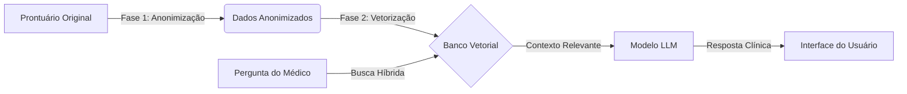

# Arquitetura de Inteligência Artificial e RAG

O Health Guardian utiliza uma arquitetura avançada de **RAG (Retrieval-Augmented Generation)** para fornecer assistência clínica inteligente, garantindo total privacidade e conformidade com a LGPD/HIPAA.

## 🔄 Fluxo de Dados: Do Prontuário à IA

O sistema opera em um pipeline de 3 estágios para transformar dados sensíveis em conhecimento acessível para a IA:

### 1. Fase 1: Segurança e Anonimização
Antes de qualquer processamento por IA, os dados do paciente passam por um rigoroso processo de limpeza:
- **Hashing**: Identificadores diretos (CPF, Nome) são substituídos por hashes HMAC-SHA256.
- **Redação**: Regex removem PII (Informações Pessoais Identificáveis) de textos livres.
- **Fail-Closed**: Se o anonimizador falhar, o dado não é processado.

### 2. Fase 2: Indexação Vetorial (RAG)
Os dados limpos são organizados seguindo a filosofia de **"IDE Médica"**:
- O histórico do paciente é estruturado como um projeto de software.
- **Chunking Semântico**: Evoluções e exames são divididos em fragmentos lógicos (ex: "Plantão UTI Dia 1", "Exames Admissionais").
- **Embeddings**: Utilizamos o modelo `bge-m3` para criar representações matemáticas densas do texto.

### 3. Fase 3: Recuperação e Resposta
Quando o médico faz uma pergunta ("O paciente teve febre ontem?"):
1.  O sistema busca fragmentos relevantes usando **Busca Híbrida** (Vetores + Palavras-chave).
2.  Os resultados são refinados por um **Reranker** para máxima precisão.
3.  A LLM (`qwen2.5` ou similar) recebe apenas os fragmentos necessários para responder, sem alucinações.

Observações de implementação:
- A busca sempre deve ser escopada por paciente (via `patientId` no debug, ou `patient_hash` internamente) para impedir vazamento entre pacientes.
- O reranker pode estar indisponível em ambientes sem acesso ao modelo; nesse caso o sistema mantém a ordenação por RRF.

## 📚 Documentação Relacionada

Para detalhes técnicos de implementação, consulte a documentação específica dos módulos:

- **[Documentação Técnica do RAG](../backend/src/services/rag/README.md)**: Detalhes sobre estratégias de chunking, modelos e configuração do indexador.
- **[Anonimização](../backend/src/services/anonymizer/README.md)** *(A ser criado)*: Detalhes sobre as regras de redação e hashing.

## 🚀 Benefícios da Arquitetura

1.  **Privacidade por Design**: A IA nunca vê os dados originais do paciente.
2.  **Rastreabilidade**: Cada resposta da IA cita as fontes (fragmentos) utilizados.
3.  **Contexto Infinito**: O banco vetorial permite processar históricos de anos em milissegundos.
