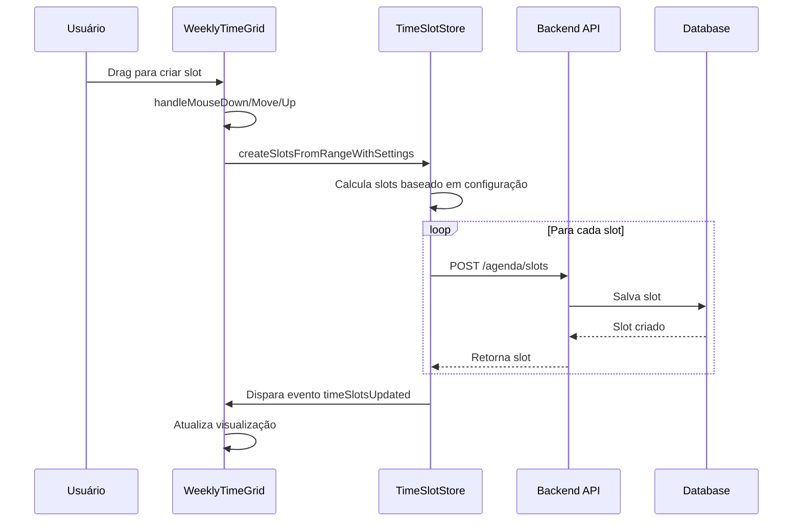
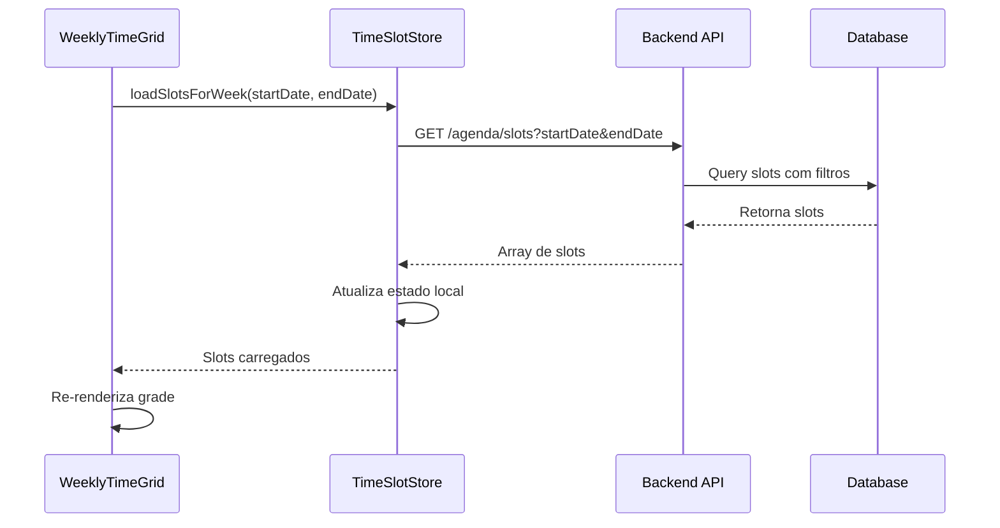

# Documentação Técnica - Health Guardian v1.0.0

## 📋 Índice

1. [Componentes Frontend](#componentes-frontend)
2. [Stores e Gerenciamento de Estado](#stores-e-gerenciamento-de-estado)
3. [API Backend](#api-backend)
4. [Modelos de Dados](#modelos-de-dados)
5. [Utilitários e Helpers](#utilitários-e-helpers)
6. [Integração e Fluxo de Dados](#integração-e-fluxo-de-dados)

---

## 🎨 Componentes Frontend

### WeeklyTimeGrid.jsx

**Localização**: `frontend/src/components/agenda/WeeklyTimeGrid.jsx`

**Propósito**: Componente principal da grade de horários semanal com funcionalidade de drag-and-drop.

#### Props
```javascript
interface WeeklyTimeGridProps {
  selectedDate: Date;           // Data selecionada para centralizar a visualização
  onDateChange: (date: Date) => void;  // Callback para mudança de data
  mode: 'availability' | 'appointment';  // Modo de operação
}
```

#### Principais Métodos

##### `getCenteredWeekDays(date)`
```javascript
/**
 * Calcula os 7 dias da semana centrados na data fornecida
 * @param {Date} date - Data central
 * @returns {Date[]} Array com 7 datas da semana
 */
const getCenteredWeekDays = (date) => {
  const startOfWeek = startOfDay(subDays(date, 3));
  return Array.from({ length: 7 }, (_, i) => addDays(startOfWeek, i));
};
```

##### `getSlotGridPos(startTime, endTime, dayIndex)`
```javascript
/**
 * Calcula posição do slot na grade
 * @param {string} startTime - Horário de início (HH:mm)
 * @param {string} endTime - Horário de fim (HH:mm)
 * @param {number} dayIndex - Índice do dia (0-6)
 * @returns {Object} Posição {top, left, height}
 */
const getSlotGridPos = (startTime, endTime, dayIndex) => {
  const startMinutes = timeToMinutes(startTime);
  const endMinutes = timeToMinutes(endTime);
  
  return {
    top: (startMinutes / 15) * SLOT_HEIGHT,
    left: TIME_COL_PX + (dayIndex * DAY_COL_PX),
    height: ((endMinutes - startMinutes) / 15) * SLOT_HEIGHT
  };
};
```

##### `handleMouseDown(e, dayIndex)`
```javascript
/**
 * Inicia criação de slot via drag
 * @param {MouseEvent} e - Evento do mouse
 * @param {number} dayIndex - Índice do dia
 */
const handleMouseDown = (e, dayIndex) => {
  if (e.button !== 0) return; // Apenas botão esquerdo
  
  const rect = e.currentTarget.getBoundingClientRect();
  const y = e.clientY - rect.top;
  const startMinutes = Math.floor(y / SLOT_HEIGHT) * 15;
  
  setDragState({
    isDragging: true,
    startMinutes,
    currentMinutes: startMinutes + 15,
    dayIndex,
    startY: y
  });
};
```

#### Hooks e Efeitos

```javascript
// Carregamento de slots para a semana atual
useEffect(() => {
  if (weekDays.length > 0) {
    const startDate = format(weekDays[0], 'yyyy-MM-dd');
    const endDate = format(weekDays[6], 'yyyy-MM-dd');
    loadSlotsForWeek(startDate, endDate);
  }
}, [weekDays, loadSlotsForWeek]);

// Listener para atualizações de slots
useEffect(() => {
  const handleSlotsUpdate = (event) => {
    if (event.detail?.action === 'update' || event.detail?.action === 'delete') {
      const startDate = format(weekDays[0], 'yyyy-MM-dd');
      const endDate = format(weekDays[6], 'yyyy-MM-dd');
      loadSlotsForWeek(startDate, endDate);
    }
  };

  window.addEventListener('timeSlotsUpdated', handleSlotsUpdate);
  return () => window.removeEventListener('timeSlotsUpdated', handleSlotsUpdate);
}, [weekDays, loadSlotsForWeek]);
```

---

### TimeSlotConfig.jsx

**Localização**: `frontend/src/components/agenda/TimeSlotConfig.jsx`

**Propósito**: Configuração de parâmetros para criação de slots de tempo.

#### Props
```javascript
interface TimeSlotConfigProps {
  isOpen: boolean;
  onClose: () => void;
  onSave: (config: SlotConfig) => void;
  initialConfig?: SlotConfig;
}
```

#### Estado Interno
```javascript
const [config, setConfig] = useState({
  appointmentDuration: 30,     // Duração em minutos
  intervalBetween: 0,          // Intervalo entre consultas
  modality: 'presencial',      // Modalidade da consulta
  activeDays: {               // Dias ativos da semana
    monday: true,
    tuesday: true,
    wednesday: true,
    thursday: true,
    friday: true,
    saturday: false,
    sunday: false
  }
});
```

---

## 🗄️ Stores e Gerenciamento de Estado

### timeSlotStore.js

**Localização**: `frontend/src/stores/timeSlotStore.js`

**Propósito**: Gerenciamento centralizado do estado dos slots de tempo com integração backend.

#### Estado Principal
```javascript
const useTimeSlotStore = create((set, get) => ({
  // Estado dos slots
  slots: [],                    // Array de slots carregados
  loading: false,               // Estado de carregamento
  error: null,                  // Mensagens de erro
  
  // Configurações
  appointmentDuration: 30,      // Duração padrão em minutos
  intervalBetween: 0,           // Intervalo entre consultas
  
  // Cache e otimização
  lastLoadedWeek: null,         // Última semana carregada
  isDirty: false,               // Indica se há mudanças não salvas
}));
```

#### Principais Ações

##### `loadSlotsForWeek(startDate, endDate)`
```javascript
/**
 * Carrega slots para uma semana específica
 * @param {string} startDate - Data de início (YYYY-MM-DD)
 * @param {string} endDate - Data de fim (YYYY-MM-DD)
 * @returns {Promise<void>}
 */
loadSlotsForWeek: async (startDate, endDate) => {
  set({ loading: true, error: null });
  
  try {
    const response = await api.get('/agenda/slots', {
      params: { startDate, endDate }
    });
    
    set({ 
      slots: response.data,
      loading: false,
      lastLoadedWeek: { startDate, endDate }
    });
  } catch (error) {
    set({ 
      error: error.message,
      loading: false 
    });
  }
}
```

##### `createSlotsFromRangeWithSettings(startTime, endTime, date, settings)`
```javascript
/**
 * Cria múltiplos slots baseado em configurações
 * @param {string} startTime - Horário de início (HH:mm)
 * @param {string} endTime - Horário de fim (HH:mm)
 * @param {Date} date - Data dos slots
 * @param {Object} settings - Configurações de duração e intervalo
 * @returns {Promise<Array>} Array de slots criados
 */
createSlotsFromRangeWithSettings: async (startTime, endTime, date, settings) => {
  const { appointmentDuration, intervalBetween } = settings;
  const slots = [];
  
  let currentTime = timeToMinutes(startTime);
  const endMinutes = timeToMinutes(endTime);
  
  while (currentTime + appointmentDuration <= endMinutes) {
    const slotEndTime = currentTime + appointmentDuration;
    
    const slotData = {
      date: format(date, 'yyyy-MM-dd'),
      startTime: minutesToTime(currentTime),
      endTime: minutesToTime(slotEndTime),
      status: 'available',
      modality: settings.modality || 'presencial'
    };
    
    try {
      const createdSlot = await get().createSlotInBackend(slotData);
      slots.push(createdSlot);
    } catch (error) {
      console.error('Erro ao criar slot:', error);
      break;
    }
    
    currentTime = slotEndTime + intervalBetween;
  }
  
  // Trigger evento para atualização da UI
  window.dispatchEvent(new CustomEvent('timeSlotsUpdated', {
    detail: { action: 'create', slots }
  }));
  
  return slots;
}
```

##### `createSlotInBackend(slotData)`
```javascript
/**
 * Cria um slot no backend
 * @param {Object} slotData - Dados do slot
 * @returns {Promise<Object>} Slot criado
 */
createSlotInBackend: async (slotData) => {
  try {
    const response = await api.post('/agenda/slots', slotData);
    
    // Atualiza store local
    set(state => ({
      slots: [...state.slots, response.data],
      isDirty: false
    }));
    
    return response.data;
  } catch (error) {
    set({ error: error.message });
    throw error;
  }
}
```

---

## 🔧 API Backend

### agenda.controller.js

**Localização**: `backend/src/controllers/agenda.controller.js`

**Propósito**: Controlador para operações de agenda médica.

#### Endpoints Principais

##### `GET /api/agenda/slots`
```javascript
/**
 * Lista slots com filtros opcionais
 * @param {Request} req - Request object
 * @param {Response} res - Response object
 * Query params:
 * - startDate: Data de início (YYYY-MM-DD)
 * - endDate: Data de fim (YYYY-MM-DD)
 * - doctorId: ID do médico
 * - status: Status do slot
 */
const getSlots = async (req, res) => {
  try {
    const { startDate, endDate, doctorId, status } = req.query;
    
    const whereClause = {};
    
    if (startDate && endDate) {
      whereClause.date = {
        [Op.between]: [startDate, endDate]
      };
    }
    
    if (doctorId) {
      whereClause.doctorId = doctorId;
    }
    
    if (status) {
      whereClause.status = status;
    }
    
    const slots = await AvailabilitySlot.findAll({
      where: whereClause,
      order: [['date', 'ASC'], ['startTime', 'ASC']]
    });
    
    res.json(slots);
  } catch (error) {
    res.status(500).json({ error: error.message });
  }
};
```

##### `POST /api/agenda/slots`
```javascript
/**
 * Cria um novo slot de disponibilidade
 * @param {Request} req - Request object
 * @param {Response} res - Response object
 * Body:
 * - date: Data do slot (YYYY-MM-DD)
 * - startTime: Horário de início (HH:mm)
 * - endTime: Horário de fim (HH:mm)
 * - modality: Modalidade da consulta
 * - status: Status inicial (default: 'available')
 */
const createSlot = async (req, res) => {
  try {
    const { date, startTime, endTime, modality, status = 'available' } = req.body;
    
    // Validação de conflitos
    const existingSlot = await AvailabilitySlot.findOne({
      where: {
        doctorId: req.user.id,
        date,
        [Op.or]: [
          {
            startTime: { [Op.lt]: endTime },
            endTime: { [Op.gt]: startTime }
          }
        ]
      }
    });
    
    if (existingSlot) {
      return res.status(409).json({ 
        error: 'Conflito de horário detectado' 
      });
    }
    
    const slot = await AvailabilitySlot.create({
      doctorId: req.user.id,
      date,
      startTime,
      endTime,
      modality,
      status
    });
    
    res.status(201).json(slot);
  } catch (error) {
    res.status(500).json({ error: error.message });
  }
};
```

##### `PUT /api/agenda/slots/:id`
```javascript
/**
 * Atualiza um slot existente
 * @param {Request} req - Request object
 * @param {Response} res - Response object
 */
const updateSlot = async (req, res) => {
  try {
    const { id } = req.params;
    const updates = req.body;
    
    const slot = await AvailabilitySlot.findOne({
      where: { 
        id, 
        doctorId: req.user.id 
      }
    });
    
    if (!slot) {
      return res.status(404).json({ 
        error: 'Slot não encontrado' 
      });
    }
    
    // Validação de conflitos se horário foi alterado
    if (updates.startTime || updates.endTime || updates.date) {
      const conflictCheck = await AvailabilitySlot.findOne({
        where: {
          id: { [Op.ne]: id },
          doctorId: req.user.id,
          date: updates.date || slot.date,
          [Op.or]: [
            {
              startTime: { [Op.lt]: updates.endTime || slot.endTime },
              endTime: { [Op.gt]: updates.startTime || slot.startTime }
            }
          ]
        }
      });
      
      if (conflictCheck) {
        return res.status(409).json({ 
          error: 'Conflito de horário detectado' 
        });
      }
    }
    
    await slot.update(updates);
    res.json(slot);
  } catch (error) {
    res.status(500).json({ error: error.message });
  }
};
```

---

## 📊 Modelos de Dados

### AvailabilitySlot Model

**Localização**: `backend/src/models/AvailabilitySlot.js`

```javascript
/**
 * Modelo para slots de disponibilidade médica
 */
const AvailabilitySlot = sequelize.define('AvailabilitySlot', {
  id: {
    type: DataTypes.UUID,
    defaultValue: DataTypes.UUIDV4,
    primaryKey: true
  },
  
  doctorId: {
    type: DataTypes.UUID,
    allowNull: false,
    references: {
      model: 'Users',
      key: 'id'
    }
  },
  
  date: {
    type: DataTypes.DATEONLY,
    allowNull: false,
    validate: {
      isDate: true,
      isAfter: new Date().toISOString().split('T')[0]
    }
  },
  
  startTime: {
    type: DataTypes.TIME,
    allowNull: false,
    validate: {
      is: /^([0-1]?[0-9]|2[0-3]):[0-5][0-9]$/
    }
  },
  
  endTime: {
    type: DataTypes.TIME,
    allowNull: false,
    validate: {
      is: /^([0-1]?[0-9]|2[0-3]):[0-5][0-9]$/,
      isAfterStartTime(value) {
        if (value <= this.startTime) {
          throw new Error('Horário de fim deve ser posterior ao de início');
        }
      }
    }
  },
  
  status: {
    type: DataTypes.ENUM('available', 'booked', 'blocked'),
    defaultValue: 'available'
  },
  
  modality: {
    type: DataTypes.ENUM('presencial', 'telemedicina', 'domiciliar'),
    defaultValue: 'presencial'
  },
  
  patientId: {
    type: DataTypes.UUID,
    allowNull: true,
    references: {
      model: 'Patients',
      key: 'id'
    }
  },
  
  notes: {
    type: DataTypes.TEXT,
    allowNull: true
  }
}, {
  tableName: 'availability_slots',
  timestamps: true,
  
  indexes: [
    {
      fields: ['doctorId', 'date', 'startTime'],
      unique: true
    },
    {
      fields: ['date', 'status']
    }
  ]
});

// Associações
AvailabilitySlot.belongsTo(User, { 
  foreignKey: 'doctorId', 
  as: 'doctor' 
});

AvailabilitySlot.belongsTo(Patient, { 
  foreignKey: 'patientId', 
  as: 'patient' 
});
```

---

## 🛠️ Utilitários e Helpers

### timeUtils.js

**Localização**: `frontend/src/utils/timeUtils.js`

```javascript
/**
 * Converte string de tempo para minutos
 * @param {string} timeStr - Tempo no formato HH:mm
 * @returns {number} Minutos desde 00:00
 */
export const timeToMinutes = (timeStr) => {
  const [hours, minutes] = timeStr.split(':').map(Number);
  return hours * 60 + minutes;
};

/**
 * Converte minutos para string de tempo
 * @param {number} minutes - Minutos desde 00:00
 * @returns {string} Tempo no formato HH:mm
 */
export const minutesToTime = (minutes) => {
  const hours = Math.floor(minutes / 60);
  const mins = minutes % 60;
  return `${hours.toString().padStart(2, '0')}:${mins.toString().padStart(2, '0')}`;
};

/**
 * Valida se um horário está dentro do range permitido
 * @param {string} time - Horário no formato HH:mm
 * @param {string} minTime - Horário mínimo
 * @param {string} maxTime - Horário máximo
 * @returns {boolean} True se válido
 */
export const isTimeInRange = (time, minTime, maxTime) => {
  const timeMinutes = timeToMinutes(time);
  const minMinutes = timeToMinutes(minTime);
  const maxMinutes = timeToMinutes(maxTime);
  
  return timeMinutes >= minMinutes && timeMinutes <= maxMinutes;
};

/**
 * Calcula duração entre dois horários
 * @param {string} startTime - Horário de início
 * @param {string} endTime - Horário de fim
 * @returns {number} Duração em minutos
 */
export const calculateDuration = (startTime, endTime) => {
  return timeToMinutes(endTime) - timeToMinutes(startTime);
};

/**
 * Adiciona minutos a um horário
 * @param {string} time - Horário base
 * @param {number} minutes - Minutos a adicionar
 * @returns {string} Novo horário
 */
export const addMinutesToTime = (time, minutes) => {
  const totalMinutes = timeToMinutes(time) + minutes;
  return minutesToTime(totalMinutes);
};
```

---

## 🔄 Integração e Fluxo de Dados

### Fluxo de Criação de Slots



### Fluxo de Carregamento de Dados



### Eventos Customizados

#### timeSlotsUpdated
```javascript
/**
 * Evento disparado quando slots são modificados
 * @param {Object} detail - Detalhes da modificação
 * @param {string} detail.action - Tipo de ação ('create', 'update', 'delete')
 * @param {Array} detail.slots - Slots afetados
 */
window.dispatchEvent(new CustomEvent('timeSlotsUpdated', {
  detail: { 
    action: 'create', 
    slots: createdSlots 
  }
}));
```

---

## 📝 Exemplos de Uso

### Criando um Slot Programaticamente

```javascript
import { useTimeSlotStore } from '../stores/timeSlotStore';

const ExampleComponent = () => {
  const { createSlotsFromRangeWithSettings } = useTimeSlotStore();
  
  const handleCreateSlots = async () => {
    const settings = {
      appointmentDuration: 30,
      intervalBetween: 15,
      modality: 'presencial'
    };
    
    const slots = await createSlotsFromRangeWithSettings(
      '09:00',
      '17:00',
      new Date(),
      settings
    );
    
    console.log('Slots criados:', slots);
  };
  
  return (
    <button onClick={handleCreateSlots}>
      Criar Slots
    </button>
  );
};
```

### Carregando Slots para uma Semana

```javascript
import { useTimeSlotStore } from '../stores/timeSlotStore';
import { format, startOfWeek, endOfWeek } from 'date-fns';

const WeeklyView = () => {
  const { loadSlotsForWeek, slots, loading } = useTimeSlotStore();
  
  useEffect(() => {
    const today = new Date();
    const start = format(startOfWeek(today), 'yyyy-MM-dd');
    const end = format(endOfWeek(today), 'yyyy-MM-dd');
    
    loadSlotsForWeek(start, end);
  }, [loadSlotsForWeek]);
  
  if (loading) return <div>Carregando...</div>;
  
  return (
    <div>
      {slots.map(slot => (
        <div key={slot.id}>
          {slot.date} - {slot.startTime} às {slot.endTime}
        </div>
      ))}
    </div>
  );
};
```

---

## 🔍 Debugging e Troubleshooting

### Logs Importantes

```javascript
// No timeSlotStore.js
console.log('Carregando slots para:', { startDate, endDate });
console.log('Slots carregados:', response.data);
console.log('Erro ao carregar slots:', error.message);

// No WeeklyTimeGrid.jsx
console.log('Posição calculada:', getSlotGridPos(startTime, endTime, dayIndex));
console.log('Estado do drag:', dragState);
console.log('Evento timeSlotsUpdated recebido:', event.detail);
```

### Problemas Comuns

1. **Slots não aparecem**: Verificar se `loadSlotsForWeek` está sendo chamado
2. **Posicionamento incorreto**: Verificar constantes `TIME_COL_PX` e `DAY_COL_PX`
3. **Conflitos de horário**: Verificar validação no backend
4. **Performance lenta**: Verificar se há listeners duplicados

---

Esta documentação técnica cobre todos os aspectos implementados no sistema de agenda médica do Health Guardian v1.0.0. Para mais detalhes sobre componentes específicos, consulte os arquivos de código fonte correspondentes.