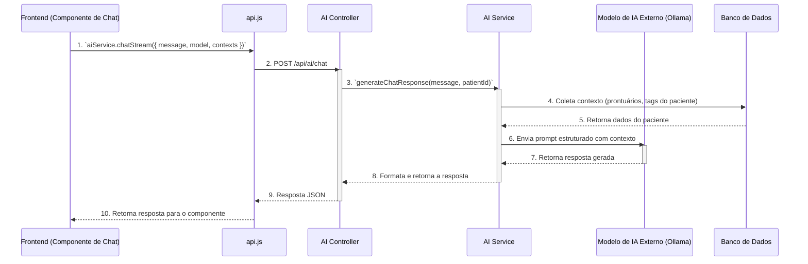

# Documentação da Integração de IA

Este documento descreve a arquitetura, o estado atual e os próximos passos para a integração de funcionalidades de Inteligência Artificial (IA) no sistema Health-Guardian.

## Estado Atual (Conflito Identificado)

**ALERTA:** Existe uma discrepância entre a documentação e o código em relação à integração da IA.

- **Frontend**
  - `frontend/src/services/aiService.js` é o serviço ativo de IA, com suporte a contexto, modelos e chat (inclui stream).
  - `frontend/src/services/api.js` ainda exporta um `aiService` legado com `chat` e `getSuggestions`, mas `getSuggestions` não possui endpoint correspondente no backend.

- **Backend**
  - `backend/src/routes/ai.routes.js` está implementado e expõe `/api/ai/models`, `/api/ai/health`, `/api/ai/context` e `/api/ai/chat`.
  - `backend/src/controllers/ai.controller.js` está implementado e faz a mediação entre o frontend e o serviço de IA.

**Consequência:** Se algum componente usar o wrapper legado (`getSuggestions`), haverá erro **404 (Not Found)**. A correção é remover o wrapper legado ou implementá-lo no backend.

## Arquitetura Pretendida

Com base nas regras do projeto (`always_applied_workspace_rules`) e na estrutura existente, a arquitetura de IA deve seguir os seguintes princípios:

1.  **Serviço de IA no Backend:** Toda a lógica de IA, incluindo a comunicação com modelos externos (como Ollama, conforme mencionado nas regras), deve ser encapsulada em um `ai.service.js` no backend.

2.  **Controlador de IA:** O `ai.controller.js` atuará como uma ponte, recebendo as requisições HTTP, chamando o serviço de IA e formatando a resposta.

3.  **Prompts Estruturados:** As prompts enviadas para o modelo de IA devem seguir um formato estruturado, conforme definido nas regras do projeto. Exemplo:

    ```python
    ANALYSIS_PROMPT = {
        "description": "Medical record analysis with FHIR compliance",
        "context_fields": ["record.content", "patient.demographics", "relevant_tags"],
        "output_format": "structured_json",
        "safety_rules": ["no_executable_code", "hipaa_compliant"]
    }
    ```

4.  **Contexto Relevante:** As chamadas para a IA devem incluir contexto rico e relevante, como o histórico do paciente, tags do prontuário e dados demográficos, para garantir respostas precisas e seguras.

## Diagrama de Fluxo da IA (Atual)



## Próximos Passos (Plano de Ação)

1.  Remover integrações legadas não usadas no frontend.
2.  Padronizar variáveis de ambiente do Ollama entre `.env` e backend.
3.  Testar a integração ponta-a-ponta do chat de IA.
