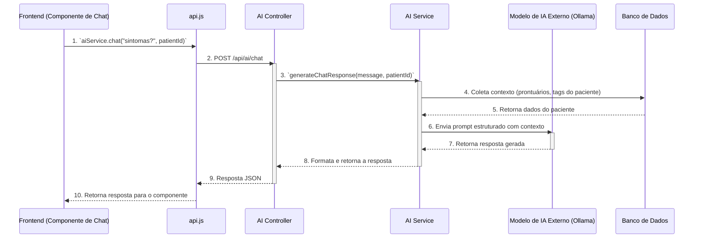

# Documentação da Integração de IA

Este documento descreve a arquitetura, o estado atual e os próximos passos para a integração de funcionalidades de Inteligência Artificial (IA) no sistema Health-Guardian.

## Estado Atual (Conflito Identificado)

**ALERTA:** Existe uma discrepância crítica entre o código do Frontend e do Backend em relação à integração da IA.

- **Frontend (`frontend/src/services/api.js`):**
  - Exporta um `aiService` com duas funções: `chat(message, patientId)` e `getSuggestions(patientId)`.
  - Essas funções tentam fazer chamadas `POST` para `/api/ai/chat` e `GET` para `/api/ai/suggestions/:patientId`, respectivamente.

- **Backend (`backend/src/routes/ai.routes.js`):**
  - O arquivo de rotas de IA existe, mas está **vazio**.
  - O `aiController` é um objeto placeholder (`{}`).
  - Os endpoints `/api/ai/chat` e `/api/ai/suggestions` **NÃO ESTÃO IMPLEMENTADOS**.

**Consequência:** Qualquer tentativa de usar as funcionalidades de IA a partir do frontend resultará em um erro **404 (Not Found)**, pois os endpoints não existem no servidor. Esta é uma prioridade a ser resolvida para habilitar as funcionalidades de IA.

## Arquitetura Pretendida

Com base nas regras do projeto (`always_applied_workspace_rules`) e na estrutura existente, a arquitetura de IA deve seguir os seguintes princípios:

1.  **Serviço de IA no Backend:** Toda a lógica de IA, incluindo a comunicação com modelos externos (como Ollama, conforme mencionado nas regras), deve ser encapsulada em um `ai.service.js` no backend.

2.  **Controlador de IA:** O `ai.controller.js` atuará como uma ponte, recebendo as requisições HTTP, chamando o serviço de IA e formatando a resposta.

3.  **Prompts Estruturados:** As prompts enviadas para o modelo de IA devem seguir um formato estruturado, conforme definido nas regras do projeto. Exemplo:

    ```python
    ANALYSIS_PROMPT = {
        "description": "Medical record analysis with FHIR compliance",
        "context_fields": ["record.content", "patient.demographics", "relevant_tags"],
        "output_format": "structured_json",
        "safety_rules": ["no_executable_code", "hipaa_compliant"]
    }
    ```

4.  **Contexto Relevante:** As chamadas para a IA devem incluir contexto rico e relevante, como o histórico do paciente, tags do prontuário e dados demográficos, para garantir respostas precisas e seguras.

## Diagrama de Fluxo da IA (Pretendido)



## Próximos Passos (Plano de Ação)

1.  **Implementar o `ai.controller.js` no Backend:** Criar as funções `chat` e `getSuggestions`.
2.  **Implementar o `ai.service.js` no Backend:** Desenvolver a lógica para construir os prompts, interagir com o modelo de IA e processar as respostas.
3.  **Conectar o Controlador às Rotas:** Atualizar o `ai.routes.js` para usar as novas funções do controlador.
4.  **Testar a Integração:** Criar testes de integração para validar o fluxo completo, desde a chamada do frontend até a resposta da IA.