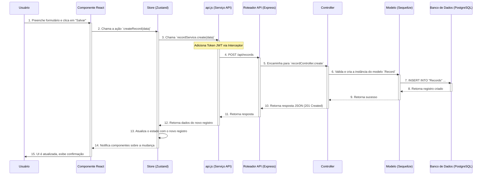

# Diagrama de Fluxo de Interação da API

Este documento descreve o fluxo de dados entre o **Frontend (React)** e o **Backend (Node.js/Express)**, detalhando como as ações do usuário se traduzem em chamadas de API e operações no banco de dados.

## Visão Geral da Arquitetura de Comunicação

A comunicação é centralizada através de uma camada de serviço robusta no frontend (`frontend/src/services/api.js`) que se comunica com uma API RESTful modular no backend.

- **Frontend:** Utiliza o `axios` com interceptadores para automação (token, retries, error handling), um *throttler* para controle de fluxo e um mecanismo de *single-flight* para otimização.
- **Backend:** Expõe endpoints RESTful claros e modulares, com tratamento de erros centralizado e middleware de autenticação.

## Diagrama de Fluxo (Mermaid)

O diagrama abaixo ilustra a interação entre os principais componentes do sistema.

## Detalhamento dos Serviços e Endpoints

A tabela abaixo mapeia os serviços do frontend para os endpoints do backend.

| Serviço Frontend (`api.js`) | Verbo HTTP | Endpoint Backend | Controlador Backend | Descrição |
| --------------------------- | ---------- | ---------------- | ------------------- | ----------- |
| `patientService.getAll`     | GET        | `/api/patients`  | `patientController` | Lista todos os pacientes. |
| `patientService.getById`    | GET        | `/api/patients/:id` | `patientController` | Obtém um paciente específico. |
| `patientService.create`     | POST       | `/api/patients`  | `patientController` | Cria um novo paciente. |
| `patientService.update`     | PUT        | `/api/patients/:id` | `patientController` | Atualiza um paciente. |
| `recordService.getByPatient`| GET        | `/api/records/patient/:id` | `recordController` | Lista prontuários de um paciente. |
| `recordService.create`      | POST       | `/api/records`   | `recordController` | Cria um novo prontuário. |
| `tagService.getAll`         | GET        | `/api/tags`      | `tagController`     | Lista todas as tags. |
| `calculatorService.getAll`  | GET        | `/api/calculators` | `calculatorController` | Lista todas as calculadoras. |
| `dynamicCalculatorService.listCalculators` | GET | `/api/dynamic-calculators` | `DynamicCalculatorController` | Lista calculadoras dinâmicas. |
| `dynamicCalculatorService.calculate` | POST | `/api/dynamic-calculators/:id/calculate` | `DynamicCalculatorController` | Executa um cálculo dinâmico. |
| `aiService.chat`            | POST       | `/api/ai/chat`   | `aiController`      | Envia uma mensagem para o chat de IA. |
| `exportService.exportToPdf` | GET        | `/api/export/pdf/:id` | `exportController` | Exporta dados do paciente para PDF. |
| ... (outros endpoints)      | ...        | ...              | ...                 | ... |

## Mecanismos Avançados

### 1. Tratamento de Erros e Retries

- **Fluxo:**
  1. `FE_ApiService` faz uma chamada.
  2. Se o `BE_Router` retorna um erro 5xx (Erro de Servidor) ou a chamada falha por rede, o interceptor de resposta do `axios` é ativado.
  3. O interceptor espera (2s, 4s, 8s) e tenta a requisição novamente (até 3 vezes).
  4. Se o erro for 401 (Não Autorizado), o usuário é redirecionado para a página de login.

### 2. Throttling (Controle de Fluxo)

- **Fluxo:**
  1. Múltiplas chamadas são feitas pelo `FE_Store` em um curto período.
  2. O `RequestThrottler` em `FE_ApiService` enfileira as requisições.
  3. Ele garante que no máximo 3 requisições sejam executadas simultaneamente, com um intervalo mínimo entre elas.
  4. Isso previne que o backend seja sobrecarregado e retorne erros 429 (Too Many Requests).

### 3. Single-Flight (Deduplicação de GETs)

- **Fluxo:**
  1. `Componente A` chama `patientService.getById(123)`.
  2. `FE_ApiService` inicia a chamada e armazena a *Promise* em um `Map`.
  3. Antes da primeira chamada terminar, `Componente B` também chama `patientService.getById(123)`.
  4. `FE_ApiService` vê que já existe uma chamada em andamento para o mesmo recurso e retorna a *Promise* existente, em vez de fazer uma nova chamada HTTP.
  5. Ambos os componentes recebem o resultado da **única** chamada feita.