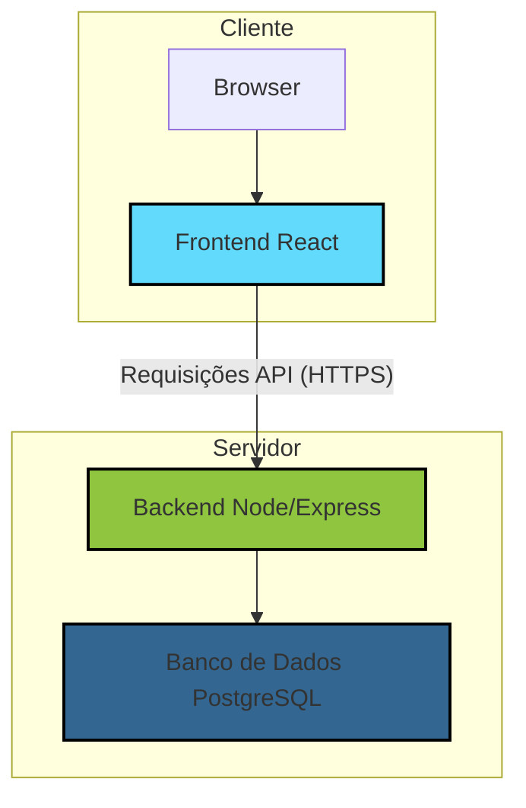

# Visão Geral do Projeto Health-Guardian

**Bem-vindo(a) ao Health-Guardian!**

Este documento é o ponto de partida central para entender a arquitetura, o fluxo de trabalho e o estado atual do nosso projeto. O objetivo é fornecer um mapa claro que permita a qualquer desenvolvedor(a), mesmo que novo(a) no projeto, contribuir de forma eficaz, mantendo o estilo e a intenção do código.

## 1. Arquitetura em Alto Nível

O projeto segue uma arquitetura cliente-servidor moderna, composta por um backend robusto e um frontend reativo e dinâmico.

- **Backend:** Construído com **Node.js** e **Express.js**, utilizando o ORM **Sequelize** para interação com um banco de dados PostgreSQL. Ele é responsável pela lógica de negócios, autenticação e persistência de dados.
- **Frontend:** Uma Single-Page Application (SPA) construída com **React**, **Vite** e **TypeScript**. Utiliza **Tailwind CSS** para estilização e **Zustand** para gerenciamento de estado global.

### Diagrama de Arquitetura

## 2. Mapa de Documentação e Análise

Esta seção funciona como um índice para a documentação detalhada gerada a partir de uma análise profunda do código. Cada documento aborda uma área específica, destacando pontos fortes, conflitos e planos de ação.

| Área Analisada | Documento de Referência | Estado | Resumo das Descobertas |
| :--- | :--- | :--- | :--- |
| **Fluxo da API** | [`api_interaction_flow.md`](./api_interaction_flow.md) | ✅ **Bom** | O frontend possui um serviço de API sofisticado com throttling, retries e single-flight. O fluxo está bem definido. |
| **Integração de IA** | [`ai_integration.md`](./ai_integration.md) | ⚠️ **Conflito** | O frontend espera endpoints de IA (`/chat`, `/suggestions`) que **não estão implementados** no backend. A funcionalidade está quebrada. |
| **Estratégia de Testes** | [`testing_strategy.md`](./testing_strategy.md) | ❌ **Crítico** | O projeto **não possui testes automatizados**. Este é um débito técnico significativo que precisa ser resolvido com urgência. |
| **Segurança & Conformidade** | [`security_and_compliance.md`](./security_and_compliance.md) | ⚠️ **Conflito** | A segurança básica (sem `eval`) está boa, mas a conformidade com **FHIR** está **quebrada** devido a um endpoint de exportação ausente no backend. |

## 3. Principais Conflitos e Débitos Técnicos

Com base na análise, os seguintes pontos requerem atenção imediata para garantir a saúde e a escalabilidade do projeto:

1.  **Ausência de Testes Automatizados:**
    - **Risco:** Alto risco de regressões a cada nova alteração.
    - **Ação:** Seguir o plano de ação detalhado em [`testing_strategy.md`](./testing_strategy.md).

2.  **Funcionalidades de IA e FHIR Quebradas:**
    - **Risco:** Funcionalidades prometidas na UI não funcionam, levando a uma má experiência do usuário e inconsistência no sistema.
    - **Ação:** Implementar os endpoints ausentes no backend, conforme detalhado em [`ai_integration.md`](./ai_integration.md) e [`security_and_compliance.md`](./security_and_compliance.md).

3.  **Coexistência de Modelos de Dados:**
    - **Risco:** O backend possui modelos de dados duplicados (ex: `User`/`Medico`, `Patient`/`Paciente`). Isso pode levar a confusão, dados inconsistentes e lógica de negócios complexa.
    - **Ação:** Planejar uma estratégia de migração para unificar os modelos de dados em um único esquema coeso.

## 4. Como Contribuir

1.  **Leia a Documentação:** Antes de codificar, familiarize-se com a arquitetura e os planos de ação nos documentos acima.
2.  **Siga as Regras do Projeto:** Consulte as `project_rules.md` para entender os padrões de codificação, documentação e arquitetura.
3.  **Resolva os Débitos Técnicos:** Priorize tarefas que abordem os conflitos e débitos técnicos identificados. Comece pelos testes!
4.  **Documente Suas Alterações:** Mantenha a documentação viva. Se você criar uma nova integração, atualize o `README.md` relevante com os conectores e hooks.